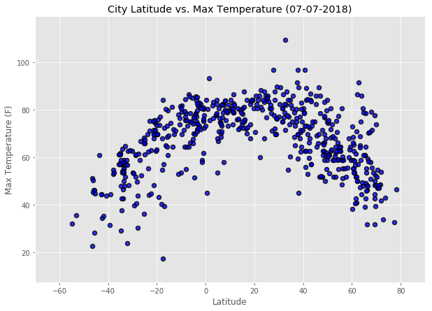
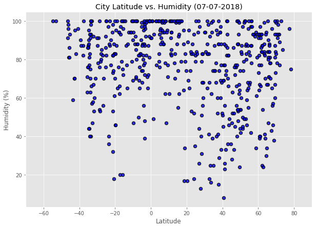
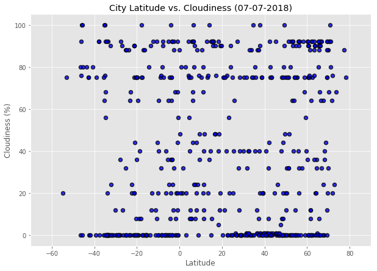
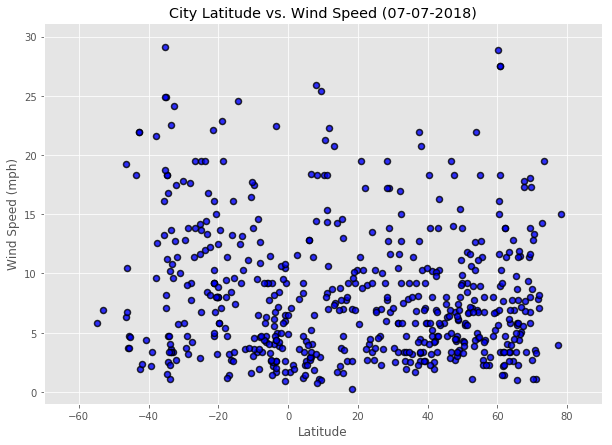

# Weather Py

**Observation 1:** Temperatures seem to be highest in the lower latitudes (closer to the equator), but the highest temperatures were recorded at cities between 15 and 35 degrees North.<br>
**Observation 2:** We are unable to record weather at all extreme latitudes where cities are not located. We have the most data in latitudes where there are commonly cities found, between -30 degrees South and 60 degrees North latitude. Another way to go about this would have been to generate random latitudes and longitudes and look directly with those coordinates in the openweathermap API, which would have allowed us to cover more of the earth's surface.<br>
**Observation 3:** Other weather elements are extremely variable, but it stands out that humidity is almost never 0, dips lowest around 20 degrees South latitude, and between 20 and 40 degrees North latitude, and it appears that it is more common for cities close to the equator to have 100% humidity than for those further away 


```python
# Dependencies and Setup
import matplotlib.pyplot as plt
from matplotlib import style
style.use('ggplot')
import pandas as pd
import numpy as np
import requests
import time as t
from datetime import datetime
from pprint import pprint
import os

# Import API key
from api_keys import api_key

# Incorporated citipy to determine city based on latitude and longitude
from citipy import citipy

# Output File (CSV)
output_data_file = "output_data/cities.csv"
directory = os.path.dirname(output_data_file)
if not os.path.exists(directory):
    os.makedirs(directory)
    
# Range of latitudes and longitudes
lat_range = (-90, 90)
lng_range = (-180, 180)
```

## Generate Cities List


```python
# List for holding lat_lngs and cities
lat_lngs = []
cities = []

# Create a set of random lat and lng combinations
lats = np.random.uniform(low=-90.000, high=90.000, size=1500)
lngs = np.random.uniform(low=-180.000, high=180.000, size=1500)
lat_lngs = zip(lats, lngs)
city_lats = []
city_lngs = []
country = []

# Identify nearest city for each lat, lng combination
for lat_lng in lat_lngs:
    city = citipy.nearest_city(lat_lng[0], lat_lng[1])
    country_code=city.country_code
    city = city.city_name
    
    # If the city is unique, then add it to a our cities list
    if city not in cities:
        cities.append(city)
        country.append(country_code)

# Print the city count to confirm sufficient count
city_data = pd.DataFrame({"City":cities, "Country":country})
print(len(city_data))
city_data.head()
```

    650
    


<div>
<style scoped>
    .dataframe tbody tr th:only-of-type {
        vertical-align: middle;
    }

    .dataframe tbody tr th {
        vertical-align: top;
    }

    .dataframe thead th {
        text-align: right;
    }
</style>
<table border="1" class="dataframe">
  <thead>
    <tr style="text-align: right;">
      <th></th>
      <th>City</th>
      <th>Country</th>
    </tr>
  </thead>
  <tbody>
    <tr>
      <th>0</th>
      <td>sosnovo-ozerskoye</td>
      <td>ru</td>
    </tr>
    <tr>
      <th>1</th>
      <td>atuona</td>
      <td>pf</td>
    </tr>
    <tr>
      <th>2</th>
      <td>hermanus</td>
      <td>za</td>
    </tr>
    <tr>
      <th>3</th>
      <td>aksarka</td>
      <td>ru</td>
    </tr>
    <tr>
      <th>4</th>
      <td>koppang</td>
      <td>no</td>
    </tr>
  </tbody>
</table>
</div>


```python
#Build out the dataframe in city_data with new columns
city_data["Lat"] = ""
city_data["Lng"] = ""
city_data["Humidity"] = ""
city_data["Max Temp"] = ""
city_data["Wind Speed"] = ""
city_data["Clouds"] = ""
city_data["Date"] = ""
city_data.head()
```


<div>
<style scoped>
    .dataframe tbody tr th:only-of-type {
        vertical-align: middle;
    }

    .dataframe tbody tr th {
        vertical-align: top;
    }

    .dataframe thead th {
        text-align: right;
    }
</style>
<table border="1" class="dataframe">
  <thead>
    <tr style="text-align: right;">
      <th></th>
      <th>City</th>
      <th>Country</th>
      <th>Lat</th>
      <th>Lng</th>
      <th>Humidity</th>
      <th>Max Temp</th>
      <th>Wind Speed</th>
      <th>Clouds</th>
      <th>Date</th>
    </tr>
  </thead>
  <tbody>
    <tr>
      <th>0</th>
      <td>sosnovo-ozerskoye</td>
      <td>ru</td>
      <td></td>
      <td></td>
      <td></td>
      <td></td>
      <td></td>
      <td></td>
      <td></td>
    </tr>
    <tr>
      <th>1</th>
      <td>atuona</td>
      <td>pf</td>
      <td></td>
      <td></td>
      <td></td>
      <td></td>
      <td></td>
      <td></td>
      <td></td>
    </tr>
    <tr>
      <th>2</th>
      <td>hermanus</td>
      <td>za</td>
      <td></td>
      <td></td>
      <td></td>
      <td></td>
      <td></td>
      <td></td>
      <td></td>
    </tr>
    <tr>
      <th>3</th>
      <td>aksarka</td>
      <td>ru</td>
      <td></td>
      <td></td>
      <td></td>
      <td></td>
      <td></td>
      <td></td>
      <td></td>
    </tr>
    <tr>
      <th>4</th>
      <td>koppang</td>
      <td>no</td>
      <td></td>
      <td></td>
      <td></td>
      <td></td>
      <td></td>
      <td></td>
      <td></td>
    </tr>
  </tbody>
</table>
</div>


```python
# Make the calls to OpenWeatherMap with correct processing
clength = len(city_data)
runs = clength // 50
extra = clength % 50
counter_a = 1
failed = 0

#Run for all the sets where 50 recrods will be pulled
for x in range(runs):
    counter_b = 1
    for y in range(50):
        z = x*50 + y
        search_city = city_data["City"][z]
        search_city = search_city.replace(" ", "%20")
        url = f'http://api.openweathermap.org/data/2.5/weather?units=Imperial&APPID={api_key}&q={search_city},{city_data["Country"][z]}'
        city_full = requests.get(url).json()
        print(f'Processing Record {counter_b} of Set {counter_a} | {city_data["City"][z]}, {city_data["Country"][z]}')
        print(f'URL: {url}')
        try:
            city_data["Lat"][z] = city_full["coord"]["lat"]
            city_data["Lng"][z] = city_full["coord"]["lon"]
            city_data["Humidity"][z] = city_full["main"]["humidity"]
            city_data["Max Temp"][z] = city_full["main"]["temp_max"]
            city_data["Wind Speed"][z] = city_full["wind"]["speed"]
            city_data["Clouds"][z] = city_full["clouds"]["all"]
            time = datetime.now()
            date = datetime.strftime(time, '%m-%d-%Y')
            city_data["Date"][z] = date
        except KeyError:
            print(f'Open Weather Map cannot find {city_data["City"][z]},{city_data["Country"][z]}')
            failed += 1
        print('------------------')
        
        counter_b += 1
    counter_a += 1
    t.sleep(30)

#Run for the last set, with less than 50 records
x = runs
counter_b = 1
for i in range(extra):
    z = i + runs*50 
    search_city = city_data["City"][z]
    search_city = search_city.replace(" ", "%20")
    url = f'http://api.openweathermap.org/data/2.5/weather?units=Metric&APPID={api_key}&q={search_city},{city_data["Country"][z]}'
    city_full = requests.get(url).json()
    print(f'Processing Record {counter_b} of Set {counter_a} | {city_data["City"][z]}, {city_data["Country"][z]}')
    print(f'URL: {url}')
    try:
        city_data["Lat"][z] = city_full["coord"]["lat"]
        city_data["Lng"][z] = city_full["coord"]["lon"]
        city_data["Humidity"][z] = city_full["main"]["humidity"]
        city_data["Max Temp"][z] = city_full["main"]["temp_max"]
        city_data["Wind Speed"][z] = city_full["wind"]["speed"]
        city_data["Clouds"][z] = city_full["clouds"]["all"]
        time = datetime.now()
        date = datetime.strftime(time, '%m-%d-%Y')
        city_data["Date"][z] = date
    except KeyError:
        print(f'Open Weather Map cannot find {city_data["City"][z]},{city_data["Country"][z]}')
        failed += 1
    print('------------------')
    
    counter_b += 1
    
print(f'Failed: {failed}')
print(f'Records Remaining: {clength-failed}')
print("-----------------------")
print("Data Retrieval Complete")
print("-----------------------")
```

    Processing Record 1 of Set 1 | sosnovo-ozerskoye, ru
    URL: http://api.openweathermap.org/data/2.5/weather?units=Imperial&APPID=67947cb38f9979cc68c6f002608b158a&q=sosnovo-ozerskoye,ru
    ------------------
    Processing Record 2 of Set 1 | atuona, pf
    URL: http://api.openweathermap.org/data/2.5/weather?units=Imperial&APPID=67947cb38f9979cc68c6f002608b158a&q=atuona,pf
    ------------------
    Processing Record 3 of Set 1 | hermanus, za
    URL: http://api.openweathermap.org/data/2.5/weather?units=Imperial&APPID=67947cb38f9979cc68c6f002608b158a&q=hermanus,za
    ------------------
    Processing Record 4 of Set 1 | aksarka, ru
    URL: http://api.openweathermap.org/data/2.5/weather?units=Imperial&APPID=67947cb38f9979cc68c6f002608b158a&q=aksarka,ru
    ------------------
    Processing Record 5 of Set 1 | koppang, no
    URL: http://api.openweathermap.org/data/2.5/weather?units=Imperial&APPID=67947cb38f9979cc68c6f002608b158a&q=koppang,no
    ------------------
    Processing Record 6 of Set 1 | nakatsugawa, jp
    URL: http://api.openweathermap.org/data/2.5/weather?units=Imperial&APPID=67947cb38f9979cc68c6f002608b158a&q=nakatsugawa,jp
    ------------------
    Processing Record 7 of Set 1 | sorvag, fo
    URL: http://api.openweathermap.org/data/2.5/weather?units=Imperial&APPID=67947cb38f9979cc68c6f002608b158a&q=sorvag,fo
    Open Weather Map cannot find sorvag,fo
    ------------------
    Processing Record 8 of Set 1 | kodiak, us
    URL: http://api.openweathermap.org/data/2.5/weather?units=Imperial&APPID=67947cb38f9979cc68c6f002608b158a&q=kodiak,us
    ------------------
    Processing Record 9 of Set 1 | vikhorevka, ru
    URL: http://api.openweathermap.org/data/2.5/weather?units=Imperial&APPID=67947cb38f9979cc68c6f002608b158a&q=vikhorevka,ru
    ------------------
    Processing Record 10 of Set 1 | provideniya, ru
    URL: http://api.openweathermap.org/data/2.5/weather?units=Imperial&APPID=67947cb38f9979cc68c6f002608b158a&q=provideniya,ru
    ------------------
    Processing Record 11 of Set 1 | hobart, au
    URL: http://api.openweathermap.org/data/2.5/weather?units=Imperial&APPID=67947cb38f9979cc68c6f002608b158a&q=hobart,au
    ------------------
    Processing Record 12 of Set 1 | luanda, ao
    URL: http://api.openweathermap.org/data/2.5/weather?units=Imperial&APPID=67947cb38f9979cc68c6f002608b158a&q=luanda,ao
    ------------------
    Processing Record 13 of Set 1 | pevek, ru
    URL: http://api.openweathermap.org/data/2.5/weather?units=Imperial&APPID=67947cb38f9979cc68c6f002608b158a&q=pevek,ru
    ------------------
    Processing Record 14 of Set 1 | soria, es
    URL: http://api.openweathermap.org/data/2.5/weather?units=Imperial&APPID=67947cb38f9979cc68c6f002608b158a&q=soria,es
    ------------------
    Processing Record 15 of Set 1 | porto walter, br
    URL: http://api.openweathermap.org/data/2.5/weather?units=Imperial&APPID=67947cb38f9979cc68c6f002608b158a&q=porto%20walter,br
    ------------------
    Processing Record 16 of Set 1 | punta arenas, cl
    URL: http://api.openweathermap.org/data/2.5/weather?units=Imperial&APPID=67947cb38f9979cc68c6f002608b158a&q=punta%20arenas,cl
    ------------------
    Processing Record 17 of Set 1 | east london, za
    URL: http://api.openweathermap.org/data/2.5/weather?units=Imperial&APPID=67947cb38f9979cc68c6f002608b158a&q=east%20london,za
    ------------------
    Processing Record 18 of Set 1 | kapaa, us
    URL: http://api.openweathermap.org/data/2.5/weather?units=Imperial&APPID=67947cb38f9979cc68c6f002608b158a&q=kapaa,us
    ------------------
    Processing Record 19 of Set 1 | tiksi, ru
    URL: http://api.openweathermap.org/data/2.5/weather?units=Imperial&APPID=67947cb38f9979cc68c6f002608b158a&q=tiksi,ru
    ------------------
    Processing Record 20 of Set 1 | lamar, us
    URL: http://api.openweathermap.org/data/2.5/weather?units=Imperial&APPID=67947cb38f9979cc68c6f002608b158a&q=lamar,us
    ------------------
    Processing Record 21 of Set 1 | torbay, ca
    URL: http://api.openweathermap.org/data/2.5/weather?units=Imperial&APPID=67947cb38f9979cc68c6f002608b158a&q=torbay,ca
    ------------------
    Processing Record 22 of Set 1 | shimoda, jp
    URL: http://api.openweathermap.org/data/2.5/weather?units=Imperial&APPID=67947cb38f9979cc68c6f002608b158a&q=shimoda,jp
    ------------------
    Processing Record 23 of Set 1 | ushuaia, ar
    URL: http://api.openweathermap.org/data/2.5/weather?units=Imperial&APPID=67947cb38f9979cc68c6f002608b158a&q=ushuaia,ar
    ------------------
    Processing Record 24 of Set 1 | vaitupu, wf
    URL: http://api.openweathermap.org/data/2.5/weather?units=Imperial&APPID=67947cb38f9979cc68c6f002608b158a&q=vaitupu,wf
    Open Weather Map cannot find vaitupu,wf
    ------------------
    Processing Record 25 of Set 1 | lakes entrance, au
    URL: http://api.openweathermap.org/data/2.5/weather?units=Imperial&APPID=67947cb38f9979cc68c6f002608b158a&q=lakes%20entrance,au
    ------------------
    Processing Record 26 of Set 1 | albany, au
    URL: http://api.openweathermap.org/data/2.5/weather?units=Imperial&APPID=67947cb38f9979cc68c6f002608b158a&q=albany,au
    ------------------
    Processing Record 27 of Set 1 | longyearbyen, sj
    URL: http://api.openweathermap.org/data/2.5/weather?units=Imperial&APPID=67947cb38f9979cc68c6f002608b158a&q=longyearbyen,sj
    ------------------
    Processing Record 28 of Set 1 | bluff, nz
    URL: http://api.openweathermap.org/data/2.5/weather?units=Imperial&APPID=67947cb38f9979cc68c6f002608b158a&q=bluff,nz
    ------------------
    Processing Record 29 of Set 1 | iqaluit, ca
    URL: http://api.openweathermap.org/data/2.5/weather?units=Imperial&APPID=67947cb38f9979cc68c6f002608b158a&q=iqaluit,ca
    ------------------
    Processing Record 30 of Set 1 | nemuro, jp
    URL: http://api.openweathermap.org/data/2.5/weather?units=Imperial&APPID=67947cb38f9979cc68c6f002608b158a&q=nemuro,jp
    ------------------
    Processing Record 31 of Set 1 | karauzyak, uz
    URL: http://api.openweathermap.org/data/2.5/weather?units=Imperial&APPID=67947cb38f9979cc68c6f002608b158a&q=karauzyak,uz
    Open Weather Map cannot find karauzyak,uz
    ------------------
    Processing Record 32 of Set 1 | jomalig, ph
    URL: http://api.openweathermap.org/data/2.5/weather?units=Imperial&APPID=67947cb38f9979cc68c6f002608b158a&q=jomalig,ph
    Open Weather Map cannot find jomalig,ph
    ------------------
    Processing Record 33 of Set 1 | cherskiy, ru
    URL: http://api.openweathermap.org/data/2.5/weather?units=Imperial&APPID=67947cb38f9979cc68c6f002608b158a&q=cherskiy,ru
    ------------------
    Processing Record 34 of Set 1 | kenora, ca
    URL: http://api.openweathermap.org/data/2.5/weather?units=Imperial&APPID=67947cb38f9979cc68c6f002608b158a&q=kenora,ca
    ------------------
    Processing Record 35 of Set 1 | tuktoyaktuk, ca
    URL: http://api.openweathermap.org/data/2.5/weather?units=Imperial&APPID=67947cb38f9979cc68c6f002608b158a&q=tuktoyaktuk,ca
    ------------------
    Processing Record 36 of Set 1 | shinjo, jp
    URL: http://api.openweathermap.org/data/2.5/weather?units=Imperial&APPID=67947cb38f9979cc68c6f002608b158a&q=shinjo,jp
    ------------------
    Processing Record 37 of Set 1 | nisia floresta, br
    URL: http://api.openweathermap.org/data/2.5/weather?units=Imperial&APPID=67947cb38f9979cc68c6f002608b158a&q=nisia%20floresta,br
    ------------------
    Processing Record 38 of Set 1 | san patricio, mx
    URL: http://api.openweathermap.org/data/2.5/weather?units=Imperial&APPID=67947cb38f9979cc68c6f002608b158a&q=san%20patricio,mx
    ------------------
    Processing Record 39 of Set 1 | ialibu, pg
    URL: http://api.openweathermap.org/data/2.5/weather?units=Imperial&APPID=67947cb38f9979cc68c6f002608b158a&q=ialibu,pg
    ------------------
    Processing Record 40 of Set 1 | paris, us
    URL: http://api.openweathermap.org/data/2.5/weather?units=Imperial&APPID=67947cb38f9979cc68c6f002608b158a&q=paris,us
    ------------------
    Processing Record 41 of Set 1 | santa cruz, cr
    URL: http://api.openweathermap.org/data/2.5/weather?units=Imperial&APPID=67947cb38f9979cc68c6f002608b158a&q=santa%20cruz,cr
    ------------------
    Processing Record 42 of Set 1 | yatou, cn
    URL: http://api.openweathermap.org/data/2.5/weather?units=Imperial&APPID=67947cb38f9979cc68c6f002608b158a&q=yatou,cn
    ------------------
    Processing Record 43 of Set 1 | flinders, au
    URL: http://api.openweathermap.org/data/2.5/weather?units=Imperial&APPID=67947cb38f9979cc68c6f002608b158a&q=flinders,au
    ------------------
    Processing Record 44 of Set 1 | busselton, au
    URL: http://api.openweathermap.org/data/2.5/weather?units=Imperial&APPID=67947cb38f9979cc68c6f002608b158a&q=busselton,au
    ------------------
    Processing Record 45 of Set 1 | ahmadpur east, pk
    URL: http://api.openweathermap.org/data/2.5/weather?units=Imperial&APPID=67947cb38f9979cc68c6f002608b158a&q=ahmadpur%20east,pk
    ------------------
    Processing Record 46 of Set 1 | khatanga, ru
    URL: http://api.openweathermap.org/data/2.5/weather?units=Imperial&APPID=67947cb38f9979cc68c6f002608b158a&q=khatanga,ru
    ------------------
    Processing Record 47 of Set 1 | amderma, ru
    URL: http://api.openweathermap.org/data/2.5/weather?units=Imperial&APPID=67947cb38f9979cc68c6f002608b158a&q=amderma,ru
    Open Weather Map cannot find amderma,ru
    ------------------
    Processing Record 48 of Set 1 | fuyang, cn
    URL: http://api.openweathermap.org/data/2.5/weather?units=Imperial&APPID=67947cb38f9979cc68c6f002608b158a&q=fuyang,cn
    ------------------
    Processing Record 49 of Set 1 | vaini, to
    URL: http://api.openweathermap.org/data/2.5/weather?units=Imperial&APPID=67947cb38f9979cc68c6f002608b158a&q=vaini,to
    ------------------
    Processing Record 50 of Set 1 | arraial do cabo, br
    URL: http://api.openweathermap.org/data/2.5/weather?units=Imperial&APPID=67947cb38f9979cc68c6f002608b158a&q=arraial%20do%20cabo,br
    ------------------
    Processing Record 1 of Set 2 | barrow, us
    URL: http://api.openweathermap.org/data/2.5/weather?units=Imperial&APPID=67947cb38f9979cc68c6f002608b158a&q=barrow,us
    ------------------
    Processing Record 2 of Set 2 | rikitea, pf
    URL: http://api.openweathermap.org/data/2.5/weather?units=Imperial&APPID=67947cb38f9979cc68c6f002608b158a&q=rikitea,pf
    ------------------
    Processing Record 3 of Set 2 | hofn, is
    URL: http://api.openweathermap.org/data/2.5/weather?units=Imperial&APPID=67947cb38f9979cc68c6f002608b158a&q=hofn,is
    ------------------
    Processing Record 4 of Set 2 | merauke, id
    URL: http://api.openweathermap.org/data/2.5/weather?units=Imperial&APPID=67947cb38f9979cc68c6f002608b158a&q=merauke,id
    ------------------
    Processing Record 5 of Set 2 | moose factory, ca
    URL: http://api.openweathermap.org/data/2.5/weather?units=Imperial&APPID=67947cb38f9979cc68c6f002608b158a&q=moose%20factory,ca
    ------------------
    Processing Record 6 of Set 2 | port elizabeth, za
    URL: http://api.openweathermap.org/data/2.5/weather?units=Imperial&APPID=67947cb38f9979cc68c6f002608b158a&q=port%20elizabeth,za
    ------------------
    Processing Record 7 of Set 2 | tasbuget, kz
    URL: http://api.openweathermap.org/data/2.5/weather?units=Imperial&APPID=67947cb38f9979cc68c6f002608b158a&q=tasbuget,kz
    Open Weather Map cannot find tasbuget,kz
    ------------------
    Processing Record 8 of Set 2 | eyl, so
    URL: http://api.openweathermap.org/data/2.5/weather?units=Imperial&APPID=67947cb38f9979cc68c6f002608b158a&q=eyl,so
    ------------------
    Processing Record 9 of Set 2 | belem, br
    URL: http://api.openweathermap.org/data/2.5/weather?units=Imperial&APPID=67947cb38f9979cc68c6f002608b158a&q=belem,br
    ------------------
    Processing Record 10 of Set 2 | cape town, za
    URL: http://api.openweathermap.org/data/2.5/weather?units=Imperial&APPID=67947cb38f9979cc68c6f002608b158a&q=cape%20town,za
    ------------------
    Processing Record 11 of Set 2 | san luis, mx
    URL: http://api.openweathermap.org/data/2.5/weather?units=Imperial&APPID=67947cb38f9979cc68c6f002608b158a&q=san%20luis,mx
    ------------------
    Processing Record 12 of Set 2 | bilma, ne
    URL: http://api.openweathermap.org/data/2.5/weather?units=Imperial&APPID=67947cb38f9979cc68c6f002608b158a&q=bilma,ne
    ------------------
    Processing Record 13 of Set 2 | yellowknife, ca
    URL: http://api.openweathermap.org/data/2.5/weather?units=Imperial&APPID=67947cb38f9979cc68c6f002608b158a&q=yellowknife,ca
    ------------------
    Processing Record 14 of Set 2 | avarua, ck
    URL: http://api.openweathermap.org/data/2.5/weather?units=Imperial&APPID=67947cb38f9979cc68c6f002608b158a&q=avarua,ck
    ------------------
    Processing Record 15 of Set 2 | sur, om
    URL: http://api.openweathermap.org/data/2.5/weather?units=Imperial&APPID=67947cb38f9979cc68c6f002608b158a&q=sur,om
    ------------------
    Processing Record 16 of Set 2 | kuybyshevskiy zaton, ru
    URL: http://api.openweathermap.org/data/2.5/weather?units=Imperial&APPID=67947cb38f9979cc68c6f002608b158a&q=kuybyshevskiy%20zaton,ru
    ------------------
    Processing Record 17 of Set 2 | kropotkin, ru
    URL: http://api.openweathermap.org/data/2.5/weather?units=Imperial&APPID=67947cb38f9979cc68c6f002608b158a&q=kropotkin,ru
    ------------------
    Processing Record 18 of Set 2 | butaritari, ki
    URL: http://api.openweathermap.org/data/2.5/weather?units=Imperial&APPID=67947cb38f9979cc68c6f002608b158a&q=butaritari,ki
    ------------------
    Processing Record 19 of Set 2 | werda, bw
    URL: http://api.openweathermap.org/data/2.5/weather?units=Imperial&APPID=67947cb38f9979cc68c6f002608b158a&q=werda,bw
    ------------------
    Processing Record 20 of Set 2 | castro, cl
    URL: http://api.openweathermap.org/data/2.5/weather?units=Imperial&APPID=67947cb38f9979cc68c6f002608b158a&q=castro,cl
    ------------------
    Processing Record 21 of Set 2 | jamestown, sh
    URL: http://api.openweathermap.org/data/2.5/weather?units=Imperial&APPID=67947cb38f9979cc68c6f002608b158a&q=jamestown,sh
    ------------------
    Processing Record 22 of Set 2 | georgetown, sh
    URL: http://api.openweathermap.org/data/2.5/weather?units=Imperial&APPID=67947cb38f9979cc68c6f002608b158a&q=georgetown,sh
    ------------------
    Processing Record 23 of Set 2 | qaanaaq, gl
    URL: http://api.openweathermap.org/data/2.5/weather?units=Imperial&APPID=67947cb38f9979cc68c6f002608b158a&q=qaanaaq,gl
    ------------------
    Processing Record 24 of Set 2 | labuhan, id
    URL: http://api.openweathermap.org/data/2.5/weather?units=Imperial&APPID=67947cb38f9979cc68c6f002608b158a&q=labuhan,id
    ------------------
    Processing Record 25 of Set 2 | puerto ayora, ec
    URL: http://api.openweathermap.org/data/2.5/weather?units=Imperial&APPID=67947cb38f9979cc68c6f002608b158a&q=puerto%20ayora,ec
    ------------------
    Processing Record 26 of Set 2 | mataura, pf
    URL: http://api.openweathermap.org/data/2.5/weather?units=Imperial&APPID=67947cb38f9979cc68c6f002608b158a&q=mataura,pf
    Open Weather Map cannot find mataura,pf
    ------------------
    Processing Record 27 of Set 2 | boddam, gb
    URL: http://api.openweathermap.org/data/2.5/weather?units=Imperial&APPID=67947cb38f9979cc68c6f002608b158a&q=boddam,gb
    ------------------
    Processing Record 28 of Set 2 | immokalee, us
    URL: http://api.openweathermap.org/data/2.5/weather?units=Imperial&APPID=67947cb38f9979cc68c6f002608b158a&q=immokalee,us
    ------------------
    Processing Record 29 of Set 2 | ambovombe, mg
    URL: http://api.openweathermap.org/data/2.5/weather?units=Imperial&APPID=67947cb38f9979cc68c6f002608b158a&q=ambovombe,mg
    ------------------
    Processing Record 30 of Set 2 | chokurdakh, ru
    URL: http://api.openweathermap.org/data/2.5/weather?units=Imperial&APPID=67947cb38f9979cc68c6f002608b158a&q=chokurdakh,ru
    ------------------
    Processing Record 31 of Set 2 | strezhevoy, ru
    URL: http://api.openweathermap.org/data/2.5/weather?units=Imperial&APPID=67947cb38f9979cc68c6f002608b158a&q=strezhevoy,ru
    ------------------
    Processing Record 32 of Set 2 | bajil, ye
    URL: http://api.openweathermap.org/data/2.5/weather?units=Imperial&APPID=67947cb38f9979cc68c6f002608b158a&q=bajil,ye
    ------------------
    Processing Record 33 of Set 2 | sao geraldo do araguaia, br
    URL: http://api.openweathermap.org/data/2.5/weather?units=Imperial&APPID=67947cb38f9979cc68c6f002608b158a&q=sao%20geraldo%20do%20araguaia,br
    ------------------
    Processing Record 34 of Set 2 | jiangyin, cn
    URL: http://api.openweathermap.org/data/2.5/weather?units=Imperial&APPID=67947cb38f9979cc68c6f002608b158a&q=jiangyin,cn
    ------------------
    Processing Record 35 of Set 2 | bubaque, gw
    URL: http://api.openweathermap.org/data/2.5/weather?units=Imperial&APPID=67947cb38f9979cc68c6f002608b158a&q=bubaque,gw
    ------------------
    Processing Record 36 of Set 2 | ambilobe, mg
    URL: http://api.openweathermap.org/data/2.5/weather?units=Imperial&APPID=67947cb38f9979cc68c6f002608b158a&q=ambilobe,mg
    ------------------
    Processing Record 37 of Set 2 | inhambane, mz
    URL: http://api.openweathermap.org/data/2.5/weather?units=Imperial&APPID=67947cb38f9979cc68c6f002608b158a&q=inhambane,mz
    ------------------
    Processing Record 38 of Set 2 | zhigansk, ru
    URL: http://api.openweathermap.org/data/2.5/weather?units=Imperial&APPID=67947cb38f9979cc68c6f002608b158a&q=zhigansk,ru
    ------------------
    Processing Record 39 of Set 2 | luganville, vu
    URL: http://api.openweathermap.org/data/2.5/weather?units=Imperial&APPID=67947cb38f9979cc68c6f002608b158a&q=luganville,vu
    ------------------
    Processing Record 40 of Set 2 | kendari, id
    URL: http://api.openweathermap.org/data/2.5/weather?units=Imperial&APPID=67947cb38f9979cc68c6f002608b158a&q=kendari,id
    ------------------
    Processing Record 41 of Set 2 | ilulissat, gl
    URL: http://api.openweathermap.org/data/2.5/weather?units=Imperial&APPID=67947cb38f9979cc68c6f002608b158a&q=ilulissat,gl
    ------------------
    Processing Record 42 of Set 2 | attawapiskat, ca
    URL: http://api.openweathermap.org/data/2.5/weather?units=Imperial&APPID=67947cb38f9979cc68c6f002608b158a&q=attawapiskat,ca
    Open Weather Map cannot find attawapiskat,ca
    ------------------
    Processing Record 43 of Set 2 | fortuna, us
    URL: http://api.openweathermap.org/data/2.5/weather?units=Imperial&APPID=67947cb38f9979cc68c6f002608b158a&q=fortuna,us
    ------------------
    Processing Record 44 of Set 2 | borovoy, ru
    URL: http://api.openweathermap.org/data/2.5/weather?units=Imperial&APPID=67947cb38f9979cc68c6f002608b158a&q=borovoy,ru
    ------------------
    Processing Record 45 of Set 2 | ngukurr, au
    URL: http://api.openweathermap.org/data/2.5/weather?units=Imperial&APPID=67947cb38f9979cc68c6f002608b158a&q=ngukurr,au
    Open Weather Map cannot find ngukurr,au
    ------------------
    Processing Record 46 of Set 2 | shkotovo-22, ru
    URL: http://api.openweathermap.org/data/2.5/weather?units=Imperial&APPID=67947cb38f9979cc68c6f002608b158a&q=shkotovo-22,ru
    Open Weather Map cannot find shkotovo-22,ru
    ------------------
    Processing Record 47 of Set 2 | vardo, no
    URL: http://api.openweathermap.org/data/2.5/weather?units=Imperial&APPID=67947cb38f9979cc68c6f002608b158a&q=vardo,no
    ------------------
    Processing Record 48 of Set 2 | severo-kurilsk, ru
    URL: http://api.openweathermap.org/data/2.5/weather?units=Imperial&APPID=67947cb38f9979cc68c6f002608b158a&q=severo-kurilsk,ru
    ------------------
    Processing Record 49 of Set 2 | upernavik, gl
    URL: http://api.openweathermap.org/data/2.5/weather?units=Imperial&APPID=67947cb38f9979cc68c6f002608b158a&q=upernavik,gl
    ------------------
    Processing Record 50 of Set 2 | sao filipe, cv
    URL: http://api.openweathermap.org/data/2.5/weather?units=Imperial&APPID=67947cb38f9979cc68c6f002608b158a&q=sao%20filipe,cv
    ------------------
    Processing Record 1 of Set 3 | nanortalik, gl
    URL: http://api.openweathermap.org/data/2.5/weather?units=Imperial&APPID=67947cb38f9979cc68c6f002608b158a&q=nanortalik,gl
    ------------------
    Processing Record 2 of Set 3 | saskylakh, ru
    URL: http://api.openweathermap.org/data/2.5/weather?units=Imperial&APPID=67947cb38f9979cc68c6f002608b158a&q=saskylakh,ru
    ------------------
    Processing Record 3 of Set 3 | hilo, us
    URL: http://api.openweathermap.org/data/2.5/weather?units=Imperial&APPID=67947cb38f9979cc68c6f002608b158a&q=hilo,us
    ------------------
    Processing Record 4 of Set 3 | traverse city, us
    URL: http://api.openweathermap.org/data/2.5/weather?units=Imperial&APPID=67947cb38f9979cc68c6f002608b158a&q=traverse%20city,us
    ------------------
    Processing Record 5 of Set 3 | egvekinot, ru
    URL: http://api.openweathermap.org/data/2.5/weather?units=Imperial&APPID=67947cb38f9979cc68c6f002608b158a&q=egvekinot,ru
    ------------------
    Processing Record 6 of Set 3 | illoqqortoormiut, gl
    URL: http://api.openweathermap.org/data/2.5/weather?units=Imperial&APPID=67947cb38f9979cc68c6f002608b158a&q=illoqqortoormiut,gl
    Open Weather Map cannot find illoqqortoormiut,gl
    ------------------
    Processing Record 7 of Set 3 | aswan, eg
    URL: http://api.openweathermap.org/data/2.5/weather?units=Imperial&APPID=67947cb38f9979cc68c6f002608b158a&q=aswan,eg
    ------------------
    Processing Record 8 of Set 3 | taolanaro, mg
    URL: http://api.openweathermap.org/data/2.5/weather?units=Imperial&APPID=67947cb38f9979cc68c6f002608b158a&q=taolanaro,mg
    Open Weather Map cannot find taolanaro,mg
    ------------------
    Processing Record 9 of Set 3 | chuy, uy
    URL: http://api.openweathermap.org/data/2.5/weather?units=Imperial&APPID=67947cb38f9979cc68c6f002608b158a&q=chuy,uy
    ------------------
    Processing Record 10 of Set 3 | port alfred, za
    URL: http://api.openweathermap.org/data/2.5/weather?units=Imperial&APPID=67947cb38f9979cc68c6f002608b158a&q=port%20alfred,za
    ------------------
    Processing Record 11 of Set 3 | sorland, no
    URL: http://api.openweathermap.org/data/2.5/weather?units=Imperial&APPID=67947cb38f9979cc68c6f002608b158a&q=sorland,no
    ------------------
    Processing Record 12 of Set 3 | bredasdorp, za
    URL: http://api.openweathermap.org/data/2.5/weather?units=Imperial&APPID=67947cb38f9979cc68c6f002608b158a&q=bredasdorp,za
    ------------------
    Processing Record 13 of Set 3 | padang, id
    URL: http://api.openweathermap.org/data/2.5/weather?units=Imperial&APPID=67947cb38f9979cc68c6f002608b158a&q=padang,id
    ------------------
    Processing Record 14 of Set 3 | shubarshi, kz
    URL: http://api.openweathermap.org/data/2.5/weather?units=Imperial&APPID=67947cb38f9979cc68c6f002608b158a&q=shubarshi,kz
    ------------------
    Processing Record 15 of Set 3 | tiarei, pf
    URL: http://api.openweathermap.org/data/2.5/weather?units=Imperial&APPID=67947cb38f9979cc68c6f002608b158a&q=tiarei,pf
    ------------------
    Processing Record 16 of Set 3 | mar del plata, ar
    URL: http://api.openweathermap.org/data/2.5/weather?units=Imperial&APPID=67947cb38f9979cc68c6f002608b158a&q=mar%20del%20plata,ar
    ------------------
    Processing Record 17 of Set 3 | new norfolk, au
    URL: http://api.openweathermap.org/data/2.5/weather?units=Imperial&APPID=67947cb38f9979cc68c6f002608b158a&q=new%20norfolk,au
    ------------------
    Processing Record 18 of Set 3 | lipno, pl
    URL: http://api.openweathermap.org/data/2.5/weather?units=Imperial&APPID=67947cb38f9979cc68c6f002608b158a&q=lipno,pl
    ------------------
    Processing Record 19 of Set 3 | isangel, vu
    URL: http://api.openweathermap.org/data/2.5/weather?units=Imperial&APPID=67947cb38f9979cc68c6f002608b158a&q=isangel,vu
    ------------------
    Processing Record 20 of Set 3 | geraldton, au
    URL: http://api.openweathermap.org/data/2.5/weather?units=Imperial&APPID=67947cb38f9979cc68c6f002608b158a&q=geraldton,au
    ------------------
    Processing Record 21 of Set 3 | lorengau, pg
    URL: http://api.openweathermap.org/data/2.5/weather?units=Imperial&APPID=67947cb38f9979cc68c6f002608b158a&q=lorengau,pg
    ------------------
    Processing Record 22 of Set 3 | lodja, cd
    URL: http://api.openweathermap.org/data/2.5/weather?units=Imperial&APPID=67947cb38f9979cc68c6f002608b158a&q=lodja,cd
    ------------------
    Processing Record 23 of Set 3 | dikson, ru
    URL: http://api.openweathermap.org/data/2.5/weather?units=Imperial&APPID=67947cb38f9979cc68c6f002608b158a&q=dikson,ru
    ------------------
    Processing Record 24 of Set 3 | robertsport, lr
    URL: http://api.openweathermap.org/data/2.5/weather?units=Imperial&APPID=67947cb38f9979cc68c6f002608b158a&q=robertsport,lr
    ------------------
    Processing Record 25 of Set 3 | beyneu, kz
    URL: http://api.openweathermap.org/data/2.5/weather?units=Imperial&APPID=67947cb38f9979cc68c6f002608b158a&q=beyneu,kz
    ------------------
    Processing Record 26 of Set 3 | kamenskoye, ru
    URL: http://api.openweathermap.org/data/2.5/weather?units=Imperial&APPID=67947cb38f9979cc68c6f002608b158a&q=kamenskoye,ru
    Open Weather Map cannot find kamenskoye,ru
    ------------------
    Processing Record 27 of Set 3 | sambava, mg
    URL: http://api.openweathermap.org/data/2.5/weather?units=Imperial&APPID=67947cb38f9979cc68c6f002608b158a&q=sambava,mg
    ------------------
    Processing Record 28 of Set 3 | mackay, au
    URL: http://api.openweathermap.org/data/2.5/weather?units=Imperial&APPID=67947cb38f9979cc68c6f002608b158a&q=mackay,au
    ------------------
    Processing Record 29 of Set 3 | codrington, ag
    URL: http://api.openweathermap.org/data/2.5/weather?units=Imperial&APPID=67947cb38f9979cc68c6f002608b158a&q=codrington,ag
    Open Weather Map cannot find codrington,ag
    ------------------
    Processing Record 30 of Set 3 | tasiilaq, gl
    URL: http://api.openweathermap.org/data/2.5/weather?units=Imperial&APPID=67947cb38f9979cc68c6f002608b158a&q=tasiilaq,gl
    ------------------
    Processing Record 31 of Set 3 | zyryanka, ru
    URL: http://api.openweathermap.org/data/2.5/weather?units=Imperial&APPID=67947cb38f9979cc68c6f002608b158a&q=zyryanka,ru
    ------------------
    Processing Record 32 of Set 3 | meulaboh, id
    URL: http://api.openweathermap.org/data/2.5/weather?units=Imperial&APPID=67947cb38f9979cc68c6f002608b158a&q=meulaboh,id
    ------------------
    Processing Record 33 of Set 3 | karratha, au
    URL: http://api.openweathermap.org/data/2.5/weather?units=Imperial&APPID=67947cb38f9979cc68c6f002608b158a&q=karratha,au
    ------------------
    Processing Record 34 of Set 3 | la rioja, ar
    URL: http://api.openweathermap.org/data/2.5/weather?units=Imperial&APPID=67947cb38f9979cc68c6f002608b158a&q=la%20rioja,ar
    ------------------
    Processing Record 35 of Set 3 | dekoa, cf
    URL: http://api.openweathermap.org/data/2.5/weather?units=Imperial&APPID=67947cb38f9979cc68c6f002608b158a&q=dekoa,cf
    Open Weather Map cannot find dekoa,cf
    ------------------
    Processing Record 36 of Set 3 | camabatela, ao
    URL: http://api.openweathermap.org/data/2.5/weather?units=Imperial&APPID=67947cb38f9979cc68c6f002608b158a&q=camabatela,ao
    ------------------
    Processing Record 37 of Set 3 | kichera, ru
    URL: http://api.openweathermap.org/data/2.5/weather?units=Imperial&APPID=67947cb38f9979cc68c6f002608b158a&q=kichera,ru
    ------------------
    Processing Record 38 of Set 3 | tazmalt, dz
    URL: http://api.openweathermap.org/data/2.5/weather?units=Imperial&APPID=67947cb38f9979cc68c6f002608b158a&q=tazmalt,dz
    ------------------
    Processing Record 39 of Set 3 | kaeo, nz
    URL: http://api.openweathermap.org/data/2.5/weather?units=Imperial&APPID=67947cb38f9979cc68c6f002608b158a&q=kaeo,nz
    ------------------
    Processing Record 40 of Set 3 | nantucket, us
    URL: http://api.openweathermap.org/data/2.5/weather?units=Imperial&APPID=67947cb38f9979cc68c6f002608b158a&q=nantucket,us
    ------------------
    Processing Record 41 of Set 3 | azad shahr, ir
    URL: http://api.openweathermap.org/data/2.5/weather?units=Imperial&APPID=67947cb38f9979cc68c6f002608b158a&q=azad%20shahr,ir
    Open Weather Map cannot find azad shahr,ir
    ------------------
    Processing Record 42 of Set 3 | kadom, ru
    URL: http://api.openweathermap.org/data/2.5/weather?units=Imperial&APPID=67947cb38f9979cc68c6f002608b158a&q=kadom,ru
    ------------------
    Processing Record 43 of Set 3 | namibe, ao
    URL: http://api.openweathermap.org/data/2.5/weather?units=Imperial&APPID=67947cb38f9979cc68c6f002608b158a&q=namibe,ao
    ------------------
    Processing Record 44 of Set 3 | norman wells, ca
    URL: http://api.openweathermap.org/data/2.5/weather?units=Imperial&APPID=67947cb38f9979cc68c6f002608b158a&q=norman%20wells,ca
    ------------------
    Processing Record 45 of Set 3 | fort walton beach, us
    URL: http://api.openweathermap.org/data/2.5/weather?units=Imperial&APPID=67947cb38f9979cc68c6f002608b158a&q=fort%20walton%20beach,us
    ------------------
    Processing Record 46 of Set 3 | grand river south east, mu
    URL: http://api.openweathermap.org/data/2.5/weather?units=Imperial&APPID=67947cb38f9979cc68c6f002608b158a&q=grand%20river%20south%20east,mu
    Open Weather Map cannot find grand river south east,mu
    ------------------
    Processing Record 47 of Set 3 | kushima, jp
    URL: http://api.openweathermap.org/data/2.5/weather?units=Imperial&APPID=67947cb38f9979cc68c6f002608b158a&q=kushima,jp
    ------------------
    Processing Record 48 of Set 3 | am timan, td
    URL: http://api.openweathermap.org/data/2.5/weather?units=Imperial&APPID=67947cb38f9979cc68c6f002608b158a&q=am%20timan,td
    ------------------
    Processing Record 49 of Set 3 | nizhneyansk, ru
    URL: http://api.openweathermap.org/data/2.5/weather?units=Imperial&APPID=67947cb38f9979cc68c6f002608b158a&q=nizhneyansk,ru
    Open Weather Map cannot find nizhneyansk,ru
    ------------------
    Processing Record 50 of Set 3 | ngawen, id
    URL: http://api.openweathermap.org/data/2.5/weather?units=Imperial&APPID=67947cb38f9979cc68c6f002608b158a&q=ngawen,id
    ------------------
    Processing Record 1 of Set 4 | baghdad, iq
    URL: http://api.openweathermap.org/data/2.5/weather?units=Imperial&APPID=67947cb38f9979cc68c6f002608b158a&q=baghdad,iq
    ------------------
    Processing Record 2 of Set 4 | natchez, us
    URL: http://api.openweathermap.org/data/2.5/weather?units=Imperial&APPID=67947cb38f9979cc68c6f002608b158a&q=natchez,us
    ------------------
    Processing Record 3 of Set 4 | sanjwal, pk
    URL: http://api.openweathermap.org/data/2.5/weather?units=Imperial&APPID=67947cb38f9979cc68c6f002608b158a&q=sanjwal,pk
    ------------------
    Processing Record 4 of Set 4 | puerto cabezas, ni
    URL: http://api.openweathermap.org/data/2.5/weather?units=Imperial&APPID=67947cb38f9979cc68c6f002608b158a&q=puerto%20cabezas,ni
    ------------------
    Processing Record 5 of Set 4 | nelson bay, au
    URL: http://api.openweathermap.org/data/2.5/weather?units=Imperial&APPID=67947cb38f9979cc68c6f002608b158a&q=nelson%20bay,au
    ------------------
    Processing Record 6 of Set 4 | alcaniz, es
    URL: http://api.openweathermap.org/data/2.5/weather?units=Imperial&APPID=67947cb38f9979cc68c6f002608b158a&q=alcaniz,es
    ------------------
    Processing Record 7 of Set 4 | la ronge, ca
    URL: http://api.openweathermap.org/data/2.5/weather?units=Imperial&APPID=67947cb38f9979cc68c6f002608b158a&q=la%20ronge,ca
    ------------------
    Processing Record 8 of Set 4 | meihekou, cn
    URL: http://api.openweathermap.org/data/2.5/weather?units=Imperial&APPID=67947cb38f9979cc68c6f002608b158a&q=meihekou,cn
    ------------------
    Processing Record 9 of Set 4 | dunedin, nz
    URL: http://api.openweathermap.org/data/2.5/weather?units=Imperial&APPID=67947cb38f9979cc68c6f002608b158a&q=dunedin,nz
    ------------------
    Processing Record 10 of Set 4 | saldanha, za
    URL: http://api.openweathermap.org/data/2.5/weather?units=Imperial&APPID=67947cb38f9979cc68c6f002608b158a&q=saldanha,za
    ------------------
    Processing Record 11 of Set 4 | port augusta, au
    URL: http://api.openweathermap.org/data/2.5/weather?units=Imperial&APPID=67947cb38f9979cc68c6f002608b158a&q=port%20augusta,au
    ------------------
    Processing Record 12 of Set 4 | lolua, tv
    URL: http://api.openweathermap.org/data/2.5/weather?units=Imperial&APPID=67947cb38f9979cc68c6f002608b158a&q=lolua,tv
    Open Weather Map cannot find lolua,tv
    ------------------
    Processing Record 13 of Set 4 | kiama, au
    URL: http://api.openweathermap.org/data/2.5/weather?units=Imperial&APPID=67947cb38f9979cc68c6f002608b158a&q=kiama,au
    ------------------
    Processing Record 14 of Set 4 | vanimo, pg
    URL: http://api.openweathermap.org/data/2.5/weather?units=Imperial&APPID=67947cb38f9979cc68c6f002608b158a&q=vanimo,pg
    ------------------
    Processing Record 15 of Set 4 | agirish, ru
    URL: http://api.openweathermap.org/data/2.5/weather?units=Imperial&APPID=67947cb38f9979cc68c6f002608b158a&q=agirish,ru
    ------------------
    Processing Record 16 of Set 4 | deputatskiy, ru
    URL: http://api.openweathermap.org/data/2.5/weather?units=Imperial&APPID=67947cb38f9979cc68c6f002608b158a&q=deputatskiy,ru
    ------------------
    Processing Record 17 of Set 4 | ulaanbaatar, mn
    URL: http://api.openweathermap.org/data/2.5/weather?units=Imperial&APPID=67947cb38f9979cc68c6f002608b158a&q=ulaanbaatar,mn
    ------------------
    Processing Record 18 of Set 4 | warqla, dz
    URL: http://api.openweathermap.org/data/2.5/weather?units=Imperial&APPID=67947cb38f9979cc68c6f002608b158a&q=warqla,dz
    Open Weather Map cannot find warqla,dz
    ------------------
    Processing Record 19 of Set 4 | bandarbeyla, so
    URL: http://api.openweathermap.org/data/2.5/weather?units=Imperial&APPID=67947cb38f9979cc68c6f002608b158a&q=bandarbeyla,so
    ------------------
    Processing Record 20 of Set 4 | pochutla, mx
    URL: http://api.openweathermap.org/data/2.5/weather?units=Imperial&APPID=67947cb38f9979cc68c6f002608b158a&q=pochutla,mx
    ------------------
    Processing Record 21 of Set 4 | rio grande, br
    URL: http://api.openweathermap.org/data/2.5/weather?units=Imperial&APPID=67947cb38f9979cc68c6f002608b158a&q=rio%20grande,br
    ------------------
    Processing Record 22 of Set 4 | saryshagan, kz
    URL: http://api.openweathermap.org/data/2.5/weather?units=Imperial&APPID=67947cb38f9979cc68c6f002608b158a&q=saryshagan,kz
    Open Weather Map cannot find saryshagan,kz
    ------------------
    Processing Record 23 of Set 4 | cidreira, br
    URL: http://api.openweathermap.org/data/2.5/weather?units=Imperial&APPID=67947cb38f9979cc68c6f002608b158a&q=cidreira,br
    ------------------
    Processing Record 24 of Set 4 | utiroa, ki
    URL: http://api.openweathermap.org/data/2.5/weather?units=Imperial&APPID=67947cb38f9979cc68c6f002608b158a&q=utiroa,ki
    Open Weather Map cannot find utiroa,ki
    ------------------
    Processing Record 25 of Set 4 | louisbourg, ca
    URL: http://api.openweathermap.org/data/2.5/weather?units=Imperial&APPID=67947cb38f9979cc68c6f002608b158a&q=louisbourg,ca
    Open Weather Map cannot find louisbourg,ca
    ------------------
    Processing Record 26 of Set 4 | wichian buri, th
    URL: http://api.openweathermap.org/data/2.5/weather?units=Imperial&APPID=67947cb38f9979cc68c6f002608b158a&q=wichian%20buri,th
    ------------------
    Processing Record 27 of Set 4 | umm lajj, sa
    URL: http://api.openweathermap.org/data/2.5/weather?units=Imperial&APPID=67947cb38f9979cc68c6f002608b158a&q=umm%20lajj,sa
    ------------------
    Processing Record 28 of Set 4 | galle, lk
    URL: http://api.openweathermap.org/data/2.5/weather?units=Imperial&APPID=67947cb38f9979cc68c6f002608b158a&q=galle,lk
    ------------------
    Processing Record 29 of Set 4 | mumford, gh
    URL: http://api.openweathermap.org/data/2.5/weather?units=Imperial&APPID=67947cb38f9979cc68c6f002608b158a&q=mumford,gh
    ------------------
    Processing Record 30 of Set 4 | bambous virieux, mu
    URL: http://api.openweathermap.org/data/2.5/weather?units=Imperial&APPID=67947cb38f9979cc68c6f002608b158a&q=bambous%20virieux,mu
    ------------------
    Processing Record 31 of Set 4 | batemans bay, au
    URL: http://api.openweathermap.org/data/2.5/weather?units=Imperial&APPID=67947cb38f9979cc68c6f002608b158a&q=batemans%20bay,au
    ------------------
    Processing Record 32 of Set 4 | kaitangata, nz
    URL: http://api.openweathermap.org/data/2.5/weather?units=Imperial&APPID=67947cb38f9979cc68c6f002608b158a&q=kaitangata,nz
    ------------------
    Processing Record 33 of Set 4 | neuquen, ar
    URL: http://api.openweathermap.org/data/2.5/weather?units=Imperial&APPID=67947cb38f9979cc68c6f002608b158a&q=neuquen,ar
    ------------------
    Processing Record 34 of Set 4 | avera, pf
    URL: http://api.openweathermap.org/data/2.5/weather?units=Imperial&APPID=67947cb38f9979cc68c6f002608b158a&q=avera,pf
    Open Weather Map cannot find avera,pf
    ------------------
    Processing Record 35 of Set 4 | mahebourg, mu
    URL: http://api.openweathermap.org/data/2.5/weather?units=Imperial&APPID=67947cb38f9979cc68c6f002608b158a&q=mahebourg,mu
    ------------------
    Processing Record 36 of Set 4 | skjervoy, no
    URL: http://api.openweathermap.org/data/2.5/weather?units=Imperial&APPID=67947cb38f9979cc68c6f002608b158a&q=skjervoy,no
    ------------------
    Processing Record 37 of Set 4 | namatanai, pg
    URL: http://api.openweathermap.org/data/2.5/weather?units=Imperial&APPID=67947cb38f9979cc68c6f002608b158a&q=namatanai,pg
    ------------------
    Processing Record 38 of Set 4 | thompson, ca
    URL: http://api.openweathermap.org/data/2.5/weather?units=Imperial&APPID=67947cb38f9979cc68c6f002608b158a&q=thompson,ca
    ------------------
    Processing Record 39 of Set 4 | ahipara, nz
    URL: http://api.openweathermap.org/data/2.5/weather?units=Imperial&APPID=67947cb38f9979cc68c6f002608b158a&q=ahipara,nz
    ------------------
    Processing Record 40 of Set 4 | ortona, it
    URL: http://api.openweathermap.org/data/2.5/weather?units=Imperial&APPID=67947cb38f9979cc68c6f002608b158a&q=ortona,it
    ------------------
    Processing Record 41 of Set 4 | lata, sb
    URL: http://api.openweathermap.org/data/2.5/weather?units=Imperial&APPID=67947cb38f9979cc68c6f002608b158a&q=lata,sb
    Open Weather Map cannot find lata,sb
    ------------------
    Processing Record 42 of Set 4 | pallasovka, ru
    URL: http://api.openweathermap.org/data/2.5/weather?units=Imperial&APPID=67947cb38f9979cc68c6f002608b158a&q=pallasovka,ru
    ------------------
    Processing Record 43 of Set 4 | beterou, bj
    URL: http://api.openweathermap.org/data/2.5/weather?units=Imperial&APPID=67947cb38f9979cc68c6f002608b158a&q=beterou,bj
    ------------------
    Processing Record 44 of Set 4 | naftah, tn
    URL: http://api.openweathermap.org/data/2.5/weather?units=Imperial&APPID=67947cb38f9979cc68c6f002608b158a&q=naftah,tn
    Open Weather Map cannot find naftah,tn
    ------------------
    Processing Record 45 of Set 4 | byumba, rw
    URL: http://api.openweathermap.org/data/2.5/weather?units=Imperial&APPID=67947cb38f9979cc68c6f002608b158a&q=byumba,rw
    ------------------
    Processing Record 46 of Set 4 | atbasar, kz
    URL: http://api.openweathermap.org/data/2.5/weather?units=Imperial&APPID=67947cb38f9979cc68c6f002608b158a&q=atbasar,kz
    ------------------
    Processing Record 47 of Set 4 | coquimbo, cl
    URL: http://api.openweathermap.org/data/2.5/weather?units=Imperial&APPID=67947cb38f9979cc68c6f002608b158a&q=coquimbo,cl
    ------------------
    Processing Record 48 of Set 4 | ozoir-la-ferriere, fr
    URL: http://api.openweathermap.org/data/2.5/weather?units=Imperial&APPID=67947cb38f9979cc68c6f002608b158a&q=ozoir-la-ferriere,fr
    ------------------
    Processing Record 49 of Set 4 | shitanjing, cn
    URL: http://api.openweathermap.org/data/2.5/weather?units=Imperial&APPID=67947cb38f9979cc68c6f002608b158a&q=shitanjing,cn
    ------------------
    Processing Record 50 of Set 4 | cap malheureux, mu
    URL: http://api.openweathermap.org/data/2.5/weather?units=Imperial&APPID=67947cb38f9979cc68c6f002608b158a&q=cap%20malheureux,mu
    ------------------
    Processing Record 1 of Set 5 | port hardy, ca
    URL: http://api.openweathermap.org/data/2.5/weather?units=Imperial&APPID=67947cb38f9979cc68c6f002608b158a&q=port%20hardy,ca
    ------------------
    Processing Record 2 of Set 5 | west wendover, us
    URL: http://api.openweathermap.org/data/2.5/weather?units=Imperial&APPID=67947cb38f9979cc68c6f002608b158a&q=west%20wendover,us
    ------------------
    Processing Record 3 of Set 5 | villarrica, cl
    URL: http://api.openweathermap.org/data/2.5/weather?units=Imperial&APPID=67947cb38f9979cc68c6f002608b158a&q=villarrica,cl
    ------------------
    Processing Record 4 of Set 5 | ternate, id
    URL: http://api.openweathermap.org/data/2.5/weather?units=Imperial&APPID=67947cb38f9979cc68c6f002608b158a&q=ternate,id
    ------------------
    Processing Record 5 of Set 5 | maceio, br
    URL: http://api.openweathermap.org/data/2.5/weather?units=Imperial&APPID=67947cb38f9979cc68c6f002608b158a&q=maceio,br
    ------------------
    Processing Record 6 of Set 5 | saleaula, ws
    URL: http://api.openweathermap.org/data/2.5/weather?units=Imperial&APPID=67947cb38f9979cc68c6f002608b158a&q=saleaula,ws
    Open Weather Map cannot find saleaula,ws
    ------------------
    Processing Record 7 of Set 5 | san joaquin, bo
    URL: http://api.openweathermap.org/data/2.5/weather?units=Imperial&APPID=67947cb38f9979cc68c6f002608b158a&q=san%20joaquin,bo
    ------------------
    Processing Record 8 of Set 5 | quatre cocos, mu
    URL: http://api.openweathermap.org/data/2.5/weather?units=Imperial&APPID=67947cb38f9979cc68c6f002608b158a&q=quatre%20cocos,mu
    ------------------
    Processing Record 9 of Set 5 | lasa, cn
    URL: http://api.openweathermap.org/data/2.5/weather?units=Imperial&APPID=67947cb38f9979cc68c6f002608b158a&q=lasa,cn
    Open Weather Map cannot find lasa,cn
    ------------------
    Processing Record 10 of Set 5 | nome, us
    URL: http://api.openweathermap.org/data/2.5/weather?units=Imperial&APPID=67947cb38f9979cc68c6f002608b158a&q=nome,us
    ------------------
    Processing Record 11 of Set 5 | oudtshoorn, za
    URL: http://api.openweathermap.org/data/2.5/weather?units=Imperial&APPID=67947cb38f9979cc68c6f002608b158a&q=oudtshoorn,za
    ------------------
    Processing Record 12 of Set 5 | barstow, us
    URL: http://api.openweathermap.org/data/2.5/weather?units=Imperial&APPID=67947cb38f9979cc68c6f002608b158a&q=barstow,us
    ------------------
    Processing Record 13 of Set 5 | tumannyy, ru
    URL: http://api.openweathermap.org/data/2.5/weather?units=Imperial&APPID=67947cb38f9979cc68c6f002608b158a&q=tumannyy,ru
    Open Weather Map cannot find tumannyy,ru
    ------------------
    Processing Record 14 of Set 5 | batagay-alyta, ru
    URL: http://api.openweathermap.org/data/2.5/weather?units=Imperial&APPID=67947cb38f9979cc68c6f002608b158a&q=batagay-alyta,ru
    ------------------
    Processing Record 15 of Set 5 | la romana, do
    URL: http://api.openweathermap.org/data/2.5/weather?units=Imperial&APPID=67947cb38f9979cc68c6f002608b158a&q=la%20romana,do
    ------------------
    Processing Record 16 of Set 5 | abu kamal, sy
    URL: http://api.openweathermap.org/data/2.5/weather?units=Imperial&APPID=67947cb38f9979cc68c6f002608b158a&q=abu%20kamal,sy
    ------------------
    Processing Record 17 of Set 5 | zheleznodorozhnyy, ru
    URL: http://api.openweathermap.org/data/2.5/weather?units=Imperial&APPID=67947cb38f9979cc68c6f002608b158a&q=zheleznodorozhnyy,ru
    ------------------
    Processing Record 18 of Set 5 | harper, lr
    URL: http://api.openweathermap.org/data/2.5/weather?units=Imperial&APPID=67947cb38f9979cc68c6f002608b158a&q=harper,lr
    ------------------
    Processing Record 19 of Set 5 | lavrentiya, ru
    URL: http://api.openweathermap.org/data/2.5/weather?units=Imperial&APPID=67947cb38f9979cc68c6f002608b158a&q=lavrentiya,ru
    ------------------
    Processing Record 20 of Set 5 | lusambo, cd
    URL: http://api.openweathermap.org/data/2.5/weather?units=Imperial&APPID=67947cb38f9979cc68c6f002608b158a&q=lusambo,cd
    ------------------
    Processing Record 21 of Set 5 | mys shmidta, ru
    URL: http://api.openweathermap.org/data/2.5/weather?units=Imperial&APPID=67947cb38f9979cc68c6f002608b158a&q=mys%20shmidta,ru
    Open Weather Map cannot find mys shmidta,ru
    ------------------
    Processing Record 22 of Set 5 | bengkulu, id
    URL: http://api.openweathermap.org/data/2.5/weather?units=Imperial&APPID=67947cb38f9979cc68c6f002608b158a&q=bengkulu,id
    Open Weather Map cannot find bengkulu,id
    ------------------
    Processing Record 23 of Set 5 | laguna, br
    URL: http://api.openweathermap.org/data/2.5/weather?units=Imperial&APPID=67947cb38f9979cc68c6f002608b158a&q=laguna,br
    Open Weather Map cannot find laguna,br
    ------------------
    Processing Record 24 of Set 5 | arrecife, es
    URL: http://api.openweathermap.org/data/2.5/weather?units=Imperial&APPID=67947cb38f9979cc68c6f002608b158a&q=arrecife,es
    ------------------
    Processing Record 25 of Set 5 | mrirt, ma
    URL: http://api.openweathermap.org/data/2.5/weather?units=Imperial&APPID=67947cb38f9979cc68c6f002608b158a&q=mrirt,ma
    Open Weather Map cannot find mrirt,ma
    ------------------
    Processing Record 26 of Set 5 | san antonio, cl
    URL: http://api.openweathermap.org/data/2.5/weather?units=Imperial&APPID=67947cb38f9979cc68c6f002608b158a&q=san%20antonio,cl
    ------------------
    Processing Record 27 of Set 5 | barra do garcas, br
    URL: http://api.openweathermap.org/data/2.5/weather?units=Imperial&APPID=67947cb38f9979cc68c6f002608b158a&q=barra%20do%20garcas,br
    ------------------
    Processing Record 28 of Set 5 | dahuk, iq
    URL: http://api.openweathermap.org/data/2.5/weather?units=Imperial&APPID=67947cb38f9979cc68c6f002608b158a&q=dahuk,iq
    Open Weather Map cannot find dahuk,iq
    ------------------
    Processing Record 29 of Set 5 | zeya, ru
    URL: http://api.openweathermap.org/data/2.5/weather?units=Imperial&APPID=67947cb38f9979cc68c6f002608b158a&q=zeya,ru
    ------------------
    Processing Record 30 of Set 5 | victoria, sc
    URL: http://api.openweathermap.org/data/2.5/weather?units=Imperial&APPID=67947cb38f9979cc68c6f002608b158a&q=victoria,sc
    ------------------
    Processing Record 31 of Set 5 | chimore, bo
    URL: http://api.openweathermap.org/data/2.5/weather?units=Imperial&APPID=67947cb38f9979cc68c6f002608b158a&q=chimore,bo
    ------------------
    Processing Record 32 of Set 5 | pitkyaranta, ru
    URL: http://api.openweathermap.org/data/2.5/weather?units=Imperial&APPID=67947cb38f9979cc68c6f002608b158a&q=pitkyaranta,ru
    ------------------
    Processing Record 33 of Set 5 | bijie, cn
    URL: http://api.openweathermap.org/data/2.5/weather?units=Imperial&APPID=67947cb38f9979cc68c6f002608b158a&q=bijie,cn
    ------------------
    Processing Record 34 of Set 5 | hami, cn
    URL: http://api.openweathermap.org/data/2.5/weather?units=Imperial&APPID=67947cb38f9979cc68c6f002608b158a&q=hami,cn
    ------------------
    Processing Record 35 of Set 5 | carnarvon, au
    URL: http://api.openweathermap.org/data/2.5/weather?units=Imperial&APPID=67947cb38f9979cc68c6f002608b158a&q=carnarvon,au
    ------------------
    Processing Record 36 of Set 5 | gat, ly
    URL: http://api.openweathermap.org/data/2.5/weather?units=Imperial&APPID=67947cb38f9979cc68c6f002608b158a&q=gat,ly
    Open Weather Map cannot find gat,ly
    ------------------
    Processing Record 37 of Set 5 | taree, au
    URL: http://api.openweathermap.org/data/2.5/weather?units=Imperial&APPID=67947cb38f9979cc68c6f002608b158a&q=taree,au
    ------------------
    Processing Record 38 of Set 5 | tungkang, tw
    URL: http://api.openweathermap.org/data/2.5/weather?units=Imperial&APPID=67947cb38f9979cc68c6f002608b158a&q=tungkang,tw
    Open Weather Map cannot find tungkang,tw
    ------------------
    Processing Record 39 of Set 5 | talnakh, ru
    URL: http://api.openweathermap.org/data/2.5/weather?units=Imperial&APPID=67947cb38f9979cc68c6f002608b158a&q=talnakh,ru
    ------------------
    Processing Record 40 of Set 5 | belushya guba, ru
    URL: http://api.openweathermap.org/data/2.5/weather?units=Imperial&APPID=67947cb38f9979cc68c6f002608b158a&q=belushya%20guba,ru
    Open Weather Map cannot find belushya guba,ru
    ------------------
    Processing Record 41 of Set 5 | warwick, au
    URL: http://api.openweathermap.org/data/2.5/weather?units=Imperial&APPID=67947cb38f9979cc68c6f002608b158a&q=warwick,au
    ------------------
    Processing Record 42 of Set 5 | luan, cn
    URL: http://api.openweathermap.org/data/2.5/weather?units=Imperial&APPID=67947cb38f9979cc68c6f002608b158a&q=luan,cn
    Open Weather Map cannot find luan,cn
    ------------------
    Processing Record 43 of Set 5 | benghazi, ly
    URL: http://api.openweathermap.org/data/2.5/weather?units=Imperial&APPID=67947cb38f9979cc68c6f002608b158a&q=benghazi,ly
    ------------------
    Processing Record 44 of Set 5 | nerchinskiy zavod, ru
    URL: http://api.openweathermap.org/data/2.5/weather?units=Imperial&APPID=67947cb38f9979cc68c6f002608b158a&q=nerchinskiy%20zavod,ru
    ------------------
    Processing Record 45 of Set 5 | tahta, eg
    URL: http://api.openweathermap.org/data/2.5/weather?units=Imperial&APPID=67947cb38f9979cc68c6f002608b158a&q=tahta,eg
    ------------------
    Processing Record 46 of Set 5 | kavaratti, in
    URL: http://api.openweathermap.org/data/2.5/weather?units=Imperial&APPID=67947cb38f9979cc68c6f002608b158a&q=kavaratti,in
    ------------------
    Processing Record 47 of Set 5 | matara, lk
    URL: http://api.openweathermap.org/data/2.5/weather?units=Imperial&APPID=67947cb38f9979cc68c6f002608b158a&q=matara,lk
    ------------------
    Processing Record 48 of Set 5 | ustyuzhna, ru
    URL: http://api.openweathermap.org/data/2.5/weather?units=Imperial&APPID=67947cb38f9979cc68c6f002608b158a&q=ustyuzhna,ru
    ------------------
    Processing Record 49 of Set 5 | soe, id
    URL: http://api.openweathermap.org/data/2.5/weather?units=Imperial&APPID=67947cb38f9979cc68c6f002608b158a&q=soe,id
    ------------------
    Processing Record 50 of Set 5 | rehoboth, na
    URL: http://api.openweathermap.org/data/2.5/weather?units=Imperial&APPID=67947cb38f9979cc68c6f002608b158a&q=rehoboth,na
    ------------------
    Processing Record 1 of Set 6 | abha, sa
    URL: http://api.openweathermap.org/data/2.5/weather?units=Imperial&APPID=67947cb38f9979cc68c6f002608b158a&q=abha,sa
    ------------------
    Processing Record 2 of Set 6 | haines junction, ca
    URL: http://api.openweathermap.org/data/2.5/weather?units=Imperial&APPID=67947cb38f9979cc68c6f002608b158a&q=haines%20junction,ca
    ------------------
    Processing Record 3 of Set 6 | peniche, pt
    URL: http://api.openweathermap.org/data/2.5/weather?units=Imperial&APPID=67947cb38f9979cc68c6f002608b158a&q=peniche,pt
    ------------------
    Processing Record 4 of Set 6 | pacific grove, us
    URL: http://api.openweathermap.org/data/2.5/weather?units=Imperial&APPID=67947cb38f9979cc68c6f002608b158a&q=pacific%20grove,us
    ------------------
    Processing Record 5 of Set 6 | ancud, cl
    URL: http://api.openweathermap.org/data/2.5/weather?units=Imperial&APPID=67947cb38f9979cc68c6f002608b158a&q=ancud,cl
    ------------------
    Processing Record 6 of Set 6 | bethel, us
    URL: http://api.openweathermap.org/data/2.5/weather?units=Imperial&APPID=67947cb38f9979cc68c6f002608b158a&q=bethel,us
    ------------------
    Processing Record 7 of Set 6 | boden, se
    URL: http://api.openweathermap.org/data/2.5/weather?units=Imperial&APPID=67947cb38f9979cc68c6f002608b158a&q=boden,se
    ------------------
    Processing Record 8 of Set 6 | aykhal, ru
    URL: http://api.openweathermap.org/data/2.5/weather?units=Imperial&APPID=67947cb38f9979cc68c6f002608b158a&q=aykhal,ru
    ------------------
    Processing Record 9 of Set 6 | esperance, au
    URL: http://api.openweathermap.org/data/2.5/weather?units=Imperial&APPID=67947cb38f9979cc68c6f002608b158a&q=esperance,au
    ------------------
    Processing Record 10 of Set 6 | tuttlingen, de
    URL: http://api.openweathermap.org/data/2.5/weather?units=Imperial&APPID=67947cb38f9979cc68c6f002608b158a&q=tuttlingen,de
    ------------------
    Processing Record 11 of Set 6 | luderitz, na
    URL: http://api.openweathermap.org/data/2.5/weather?units=Imperial&APPID=67947cb38f9979cc68c6f002608b158a&q=luderitz,na
    ------------------
    Processing Record 12 of Set 6 | saint-philippe, re
    URL: http://api.openweathermap.org/data/2.5/weather?units=Imperial&APPID=67947cb38f9979cc68c6f002608b158a&q=saint-philippe,re
    ------------------
    Processing Record 13 of Set 6 | pleasanton, us
    URL: http://api.openweathermap.org/data/2.5/weather?units=Imperial&APPID=67947cb38f9979cc68c6f002608b158a&q=pleasanton,us
    ------------------
    Processing Record 14 of Set 6 | husavik, is
    URL: http://api.openweathermap.org/data/2.5/weather?units=Imperial&APPID=67947cb38f9979cc68c6f002608b158a&q=husavik,is
    ------------------
    Processing Record 15 of Set 6 | sobolevo, ru
    URL: http://api.openweathermap.org/data/2.5/weather?units=Imperial&APPID=67947cb38f9979cc68c6f002608b158a&q=sobolevo,ru
    ------------------
    Processing Record 16 of Set 6 | kahului, us
    URL: http://api.openweathermap.org/data/2.5/weather?units=Imperial&APPID=67947cb38f9979cc68c6f002608b158a&q=kahului,us
    ------------------
    Processing Record 17 of Set 6 | ribeira grande, pt
    URL: http://api.openweathermap.org/data/2.5/weather?units=Imperial&APPID=67947cb38f9979cc68c6f002608b158a&q=ribeira%20grande,pt
    ------------------
    Processing Record 18 of Set 6 | mayo, ca
    URL: http://api.openweathermap.org/data/2.5/weather?units=Imperial&APPID=67947cb38f9979cc68c6f002608b158a&q=mayo,ca
    ------------------
    Processing Record 19 of Set 6 | ambikapur, in
    URL: http://api.openweathermap.org/data/2.5/weather?units=Imperial&APPID=67947cb38f9979cc68c6f002608b158a&q=ambikapur,in
    ------------------
    Processing Record 20 of Set 6 | ribas do rio pardo, br
    URL: http://api.openweathermap.org/data/2.5/weather?units=Imperial&APPID=67947cb38f9979cc68c6f002608b158a&q=ribas%20do%20rio%20pardo,br
    ------------------
    Processing Record 21 of Set 6 | katsuura, jp
    URL: http://api.openweathermap.org/data/2.5/weather?units=Imperial&APPID=67947cb38f9979cc68c6f002608b158a&q=katsuura,jp
    ------------------
    Processing Record 22 of Set 6 | coihaique, cl
    URL: http://api.openweathermap.org/data/2.5/weather?units=Imperial&APPID=67947cb38f9979cc68c6f002608b158a&q=coihaique,cl
    ------------------
    Processing Record 23 of Set 6 | hovd, mn
    URL: http://api.openweathermap.org/data/2.5/weather?units=Imperial&APPID=67947cb38f9979cc68c6f002608b158a&q=hovd,mn
    ------------------
    Processing Record 24 of Set 6 | cheyenne, us
    URL: http://api.openweathermap.org/data/2.5/weather?units=Imperial&APPID=67947cb38f9979cc68c6f002608b158a&q=cheyenne,us
    ------------------
    Processing Record 25 of Set 6 | gazojak, tm
    URL: http://api.openweathermap.org/data/2.5/weather?units=Imperial&APPID=67947cb38f9979cc68c6f002608b158a&q=gazojak,tm
    ------------------
    Processing Record 26 of Set 6 | ixtapa, mx
    URL: http://api.openweathermap.org/data/2.5/weather?units=Imperial&APPID=67947cb38f9979cc68c6f002608b158a&q=ixtapa,mx
    ------------------
    Processing Record 27 of Set 6 | cuicatlan, mx
    URL: http://api.openweathermap.org/data/2.5/weather?units=Imperial&APPID=67947cb38f9979cc68c6f002608b158a&q=cuicatlan,mx
    Open Weather Map cannot find cuicatlan,mx
    ------------------
    Processing Record 28 of Set 6 | yankton, us
    URL: http://api.openweathermap.org/data/2.5/weather?units=Imperial&APPID=67947cb38f9979cc68c6f002608b158a&q=yankton,us
    ------------------
    Processing Record 29 of Set 6 | puerto carreno, co
    URL: http://api.openweathermap.org/data/2.5/weather?units=Imperial&APPID=67947cb38f9979cc68c6f002608b158a&q=puerto%20carreno,co
    ------------------
    Processing Record 30 of Set 6 | anar darreh, af
    URL: http://api.openweathermap.org/data/2.5/weather?units=Imperial&APPID=67947cb38f9979cc68c6f002608b158a&q=anar%20darreh,af
    Open Weather Map cannot find anar darreh,af
    ------------------
    Processing Record 31 of Set 6 | lincoln, ar
    URL: http://api.openweathermap.org/data/2.5/weather?units=Imperial&APPID=67947cb38f9979cc68c6f002608b158a&q=lincoln,ar
    ------------------
    Processing Record 32 of Set 6 | dzhebariki-khaya, ru
    URL: http://api.openweathermap.org/data/2.5/weather?units=Imperial&APPID=67947cb38f9979cc68c6f002608b158a&q=dzhebariki-khaya,ru
    ------------------
    Processing Record 33 of Set 6 | hithadhoo, mv
    URL: http://api.openweathermap.org/data/2.5/weather?units=Imperial&APPID=67947cb38f9979cc68c6f002608b158a&q=hithadhoo,mv
    ------------------
    Processing Record 34 of Set 6 | assiniboia, ca
    URL: http://api.openweathermap.org/data/2.5/weather?units=Imperial&APPID=67947cb38f9979cc68c6f002608b158a&q=assiniboia,ca
    ------------------
    Processing Record 35 of Set 6 | coro, ve
    URL: http://api.openweathermap.org/data/2.5/weather?units=Imperial&APPID=67947cb38f9979cc68c6f002608b158a&q=coro,ve
    ------------------
    Processing Record 36 of Set 6 | manado, id
    URL: http://api.openweathermap.org/data/2.5/weather?units=Imperial&APPID=67947cb38f9979cc68c6f002608b158a&q=manado,id
    ------------------
    Processing Record 37 of Set 6 | dovbysh, ua
    URL: http://api.openweathermap.org/data/2.5/weather?units=Imperial&APPID=67947cb38f9979cc68c6f002608b158a&q=dovbysh,ua
    ------------------
    Processing Record 38 of Set 6 | awjilah, ly
    URL: http://api.openweathermap.org/data/2.5/weather?units=Imperial&APPID=67947cb38f9979cc68c6f002608b158a&q=awjilah,ly
    ------------------
    Processing Record 39 of Set 6 | reitz, za
    URL: http://api.openweathermap.org/data/2.5/weather?units=Imperial&APPID=67947cb38f9979cc68c6f002608b158a&q=reitz,za
    ------------------
    Processing Record 40 of Set 6 | cerro punta, pa
    URL: http://api.openweathermap.org/data/2.5/weather?units=Imperial&APPID=67947cb38f9979cc68c6f002608b158a&q=cerro%20punta,pa
    ------------------
    Processing Record 41 of Set 6 | russell, nz
    URL: http://api.openweathermap.org/data/2.5/weather?units=Imperial&APPID=67947cb38f9979cc68c6f002608b158a&q=russell,nz
    ------------------
    Processing Record 42 of Set 6 | kenai, us
    URL: http://api.openweathermap.org/data/2.5/weather?units=Imperial&APPID=67947cb38f9979cc68c6f002608b158a&q=kenai,us
    ------------------
    Processing Record 43 of Set 6 | nigde, tr
    URL: http://api.openweathermap.org/data/2.5/weather?units=Imperial&APPID=67947cb38f9979cc68c6f002608b158a&q=nigde,tr
    ------------------
    Processing Record 44 of Set 6 | puerto colombia, co
    URL: http://api.openweathermap.org/data/2.5/weather?units=Imperial&APPID=67947cb38f9979cc68c6f002608b158a&q=puerto%20colombia,co
    ------------------
    Processing Record 45 of Set 6 | half moon bay, us
    URL: http://api.openweathermap.org/data/2.5/weather?units=Imperial&APPID=67947cb38f9979cc68c6f002608b158a&q=half%20moon%20bay,us
    ------------------
    Processing Record 46 of Set 6 | matay, eg
    URL: http://api.openweathermap.org/data/2.5/weather?units=Imperial&APPID=67947cb38f9979cc68c6f002608b158a&q=matay,eg
    ------------------
    Processing Record 47 of Set 6 | gurgan, az
    URL: http://api.openweathermap.org/data/2.5/weather?units=Imperial&APPID=67947cb38f9979cc68c6f002608b158a&q=gurgan,az
    Open Weather Map cannot find gurgan,az
    ------------------
    Processing Record 48 of Set 6 | semporna, my
    URL: http://api.openweathermap.org/data/2.5/weather?units=Imperial&APPID=67947cb38f9979cc68c6f002608b158a&q=semporna,my
    ------------------
    Processing Record 49 of Set 6 | dingle, ie
    URL: http://api.openweathermap.org/data/2.5/weather?units=Imperial&APPID=67947cb38f9979cc68c6f002608b158a&q=dingle,ie
    ------------------
    Processing Record 50 of Set 6 | mirnyy, ru
    URL: http://api.openweathermap.org/data/2.5/weather?units=Imperial&APPID=67947cb38f9979cc68c6f002608b158a&q=mirnyy,ru
    ------------------
    Processing Record 1 of Set 7 | bolshegrivskoye, ru
    URL: http://api.openweathermap.org/data/2.5/weather?units=Imperial&APPID=67947cb38f9979cc68c6f002608b158a&q=bolshegrivskoye,ru
    Open Weather Map cannot find bolshegrivskoye,ru
    ------------------
    Processing Record 2 of Set 7 | maunabo, us
    URL: http://api.openweathermap.org/data/2.5/weather?units=Imperial&APPID=67947cb38f9979cc68c6f002608b158a&q=maunabo,us
    Open Weather Map cannot find maunabo,us
    ------------------
    Processing Record 3 of Set 7 | uberaba, br
    URL: http://api.openweathermap.org/data/2.5/weather?units=Imperial&APPID=67947cb38f9979cc68c6f002608b158a&q=uberaba,br
    ------------------
    Processing Record 4 of Set 7 | hasaki, jp
    URL: http://api.openweathermap.org/data/2.5/weather?units=Imperial&APPID=67947cb38f9979cc68c6f002608b158a&q=hasaki,jp
    ------------------
    Processing Record 5 of Set 7 | masaurhi, in
    URL: http://api.openweathermap.org/data/2.5/weather?units=Imperial&APPID=67947cb38f9979cc68c6f002608b158a&q=masaurhi,in
    ------------------
    Processing Record 6 of Set 7 | cockburn town, bs
    URL: http://api.openweathermap.org/data/2.5/weather?units=Imperial&APPID=67947cb38f9979cc68c6f002608b158a&q=cockburn%20town,bs
    ------------------
    Processing Record 7 of Set 7 | nikolskoye, ru
    URL: http://api.openweathermap.org/data/2.5/weather?units=Imperial&APPID=67947cb38f9979cc68c6f002608b158a&q=nikolskoye,ru
    ------------------
    Processing Record 8 of Set 7 | miranda de ebro, es
    URL: http://api.openweathermap.org/data/2.5/weather?units=Imperial&APPID=67947cb38f9979cc68c6f002608b158a&q=miranda%20de%20ebro,es
    ------------------
    Processing Record 9 of Set 7 | sorong, id
    URL: http://api.openweathermap.org/data/2.5/weather?units=Imperial&APPID=67947cb38f9979cc68c6f002608b158a&q=sorong,id
    ------------------
    Processing Record 10 of Set 7 | alofi, nu
    URL: http://api.openweathermap.org/data/2.5/weather?units=Imperial&APPID=67947cb38f9979cc68c6f002608b158a&q=alofi,nu
    ------------------
    Processing Record 11 of Set 7 | planaltina, br
    URL: http://api.openweathermap.org/data/2.5/weather?units=Imperial&APPID=67947cb38f9979cc68c6f002608b158a&q=planaltina,br
    ------------------
    Processing Record 12 of Set 7 | miri, my
    URL: http://api.openweathermap.org/data/2.5/weather?units=Imperial&APPID=67947cb38f9979cc68c6f002608b158a&q=miri,my
    ------------------
    Processing Record 13 of Set 7 | ust-kuyga, ru
    URL: http://api.openweathermap.org/data/2.5/weather?units=Imperial&APPID=67947cb38f9979cc68c6f002608b158a&q=ust-kuyga,ru
    ------------------
    Processing Record 14 of Set 7 | hirara, jp
    URL: http://api.openweathermap.org/data/2.5/weather?units=Imperial&APPID=67947cb38f9979cc68c6f002608b158a&q=hirara,jp
    ------------------
    Processing Record 15 of Set 7 | dibulla, co
    URL: http://api.openweathermap.org/data/2.5/weather?units=Imperial&APPID=67947cb38f9979cc68c6f002608b158a&q=dibulla,co
    ------------------
    Processing Record 16 of Set 7 | los llanos de aridane, es
    URL: http://api.openweathermap.org/data/2.5/weather?units=Imperial&APPID=67947cb38f9979cc68c6f002608b158a&q=los%20llanos%20de%20aridane,es
    ------------------
    Processing Record 17 of Set 7 | sabha, ly
    URL: http://api.openweathermap.org/data/2.5/weather?units=Imperial&APPID=67947cb38f9979cc68c6f002608b158a&q=sabha,ly
    ------------------
    Processing Record 18 of Set 7 | airai, pw
    URL: http://api.openweathermap.org/data/2.5/weather?units=Imperial&APPID=67947cb38f9979cc68c6f002608b158a&q=airai,pw
    Open Weather Map cannot find airai,pw
    ------------------
    Processing Record 19 of Set 7 | waitati, nz
    URL: http://api.openweathermap.org/data/2.5/weather?units=Imperial&APPID=67947cb38f9979cc68c6f002608b158a&q=waitati,nz
    ------------------
    Processing Record 20 of Set 7 | boa viagem, br
    URL: http://api.openweathermap.org/data/2.5/weather?units=Imperial&APPID=67947cb38f9979cc68c6f002608b158a&q=boa%20viagem,br
    ------------------
    Processing Record 21 of Set 7 | quime, bo
    URL: http://api.openweathermap.org/data/2.5/weather?units=Imperial&APPID=67947cb38f9979cc68c6f002608b158a&q=quime,bo
    ------------------
    Processing Record 22 of Set 7 | aquiraz, br
    URL: http://api.openweathermap.org/data/2.5/weather?units=Imperial&APPID=67947cb38f9979cc68c6f002608b158a&q=aquiraz,br
    ------------------
    Processing Record 23 of Set 7 | buique, br
    URL: http://api.openweathermap.org/data/2.5/weather?units=Imperial&APPID=67947cb38f9979cc68c6f002608b158a&q=buique,br
    ------------------
    Processing Record 24 of Set 7 | san jose, gt
    URL: http://api.openweathermap.org/data/2.5/weather?units=Imperial&APPID=67947cb38f9979cc68c6f002608b158a&q=san%20jose,gt
    ------------------
    Processing Record 25 of Set 7 | fort nelson, ca
    URL: http://api.openweathermap.org/data/2.5/weather?units=Imperial&APPID=67947cb38f9979cc68c6f002608b158a&q=fort%20nelson,ca
    ------------------
    Processing Record 26 of Set 7 | constitucion, mx
    URL: http://api.openweathermap.org/data/2.5/weather?units=Imperial&APPID=67947cb38f9979cc68c6f002608b158a&q=constitucion,mx
    ------------------
    Processing Record 27 of Set 7 | bonnyville, ca
    URL: http://api.openweathermap.org/data/2.5/weather?units=Imperial&APPID=67947cb38f9979cc68c6f002608b158a&q=bonnyville,ca
    ------------------
    Processing Record 28 of Set 7 | suclayin, ph
    URL: http://api.openweathermap.org/data/2.5/weather?units=Imperial&APPID=67947cb38f9979cc68c6f002608b158a&q=suclayin,ph
    ------------------
    Processing Record 29 of Set 7 | portland, au
    URL: http://api.openweathermap.org/data/2.5/weather?units=Imperial&APPID=67947cb38f9979cc68c6f002608b158a&q=portland,au
    ------------------
    Processing Record 30 of Set 7 | saint anthony, ca
    URL: http://api.openweathermap.org/data/2.5/weather?units=Imperial&APPID=67947cb38f9979cc68c6f002608b158a&q=saint%20anthony,ca
    Open Weather Map cannot find saint anthony,ca
    ------------------
    Processing Record 31 of Set 7 | sao goncalo dos campos, br
    URL: http://api.openweathermap.org/data/2.5/weather?units=Imperial&APPID=67947cb38f9979cc68c6f002608b158a&q=sao%20goncalo%20dos%20campos,br
    ------------------
    Processing Record 32 of Set 7 | bara, sd
    URL: http://api.openweathermap.org/data/2.5/weather?units=Imperial&APPID=67947cb38f9979cc68c6f002608b158a&q=bara,sd
    Open Weather Map cannot find bara,sd
    ------------------
    Processing Record 33 of Set 7 | aitape, pg
    URL: http://api.openweathermap.org/data/2.5/weather?units=Imperial&APPID=67947cb38f9979cc68c6f002608b158a&q=aitape,pg
    ------------------
    Processing Record 34 of Set 7 | korsakovo, ru
    URL: http://api.openweathermap.org/data/2.5/weather?units=Imperial&APPID=67947cb38f9979cc68c6f002608b158a&q=korsakovo,ru
    ------------------
    Processing Record 35 of Set 7 | kloulklubed, pw
    URL: http://api.openweathermap.org/data/2.5/weather?units=Imperial&APPID=67947cb38f9979cc68c6f002608b158a&q=kloulklubed,pw
    ------------------
    Processing Record 36 of Set 7 | victor harbor, au
    URL: http://api.openweathermap.org/data/2.5/weather?units=Imperial&APPID=67947cb38f9979cc68c6f002608b158a&q=victor%20harbor,au
    ------------------
    Processing Record 37 of Set 7 | griffith, au
    URL: http://api.openweathermap.org/data/2.5/weather?units=Imperial&APPID=67947cb38f9979cc68c6f002608b158a&q=griffith,au
    ------------------
    Processing Record 38 of Set 7 | duz, tn
    URL: http://api.openweathermap.org/data/2.5/weather?units=Imperial&APPID=67947cb38f9979cc68c6f002608b158a&q=duz,tn
    Open Weather Map cannot find duz,tn
    ------------------
    Processing Record 39 of Set 7 | shadegan, ir
    URL: http://api.openweathermap.org/data/2.5/weather?units=Imperial&APPID=67947cb38f9979cc68c6f002608b158a&q=shadegan,ir
    ------------------
    Processing Record 40 of Set 7 | papara, pf
    URL: http://api.openweathermap.org/data/2.5/weather?units=Imperial&APPID=67947cb38f9979cc68c6f002608b158a&q=papara,pf
    Open Weather Map cannot find papara,pf
    ------------------
    Processing Record 41 of Set 7 | gamba, ga
    URL: http://api.openweathermap.org/data/2.5/weather?units=Imperial&APPID=67947cb38f9979cc68c6f002608b158a&q=gamba,ga
    ------------------
    Processing Record 42 of Set 7 | sitka, us
    URL: http://api.openweathermap.org/data/2.5/weather?units=Imperial&APPID=67947cb38f9979cc68c6f002608b158a&q=sitka,us
    ------------------
    Processing Record 43 of Set 7 | taiyuan, cn
    URL: http://api.openweathermap.org/data/2.5/weather?units=Imperial&APPID=67947cb38f9979cc68c6f002608b158a&q=taiyuan,cn
    ------------------
    Processing Record 44 of Set 7 | chicama, pe
    URL: http://api.openweathermap.org/data/2.5/weather?units=Imperial&APPID=67947cb38f9979cc68c6f002608b158a&q=chicama,pe
    ------------------
    Processing Record 45 of Set 7 | bilibino, ru
    URL: http://api.openweathermap.org/data/2.5/weather?units=Imperial&APPID=67947cb38f9979cc68c6f002608b158a&q=bilibino,ru
    ------------------
    Processing Record 46 of Set 7 | yuancheng, cn
    URL: http://api.openweathermap.org/data/2.5/weather?units=Imperial&APPID=67947cb38f9979cc68c6f002608b158a&q=yuancheng,cn
    ------------------
    Processing Record 47 of Set 7 | tabas, ir
    URL: http://api.openweathermap.org/data/2.5/weather?units=Imperial&APPID=67947cb38f9979cc68c6f002608b158a&q=tabas,ir
    ------------------
    Processing Record 48 of Set 7 | lazaro cardenas, mx
    URL: http://api.openweathermap.org/data/2.5/weather?units=Imperial&APPID=67947cb38f9979cc68c6f002608b158a&q=lazaro%20cardenas,mx
    ------------------
    Processing Record 49 of Set 7 | salinas, ec
    URL: http://api.openweathermap.org/data/2.5/weather?units=Imperial&APPID=67947cb38f9979cc68c6f002608b158a&q=salinas,ec
    ------------------
    Processing Record 50 of Set 7 | ust-nera, ru
    URL: http://api.openweathermap.org/data/2.5/weather?units=Imperial&APPID=67947cb38f9979cc68c6f002608b158a&q=ust-nera,ru
    ------------------
    Processing Record 1 of Set 8 | udachnyy, ru
    URL: http://api.openweathermap.org/data/2.5/weather?units=Imperial&APPID=67947cb38f9979cc68c6f002608b158a&q=udachnyy,ru
    ------------------
    Processing Record 2 of Set 8 | saint-leu, re
    URL: http://api.openweathermap.org/data/2.5/weather?units=Imperial&APPID=67947cb38f9979cc68c6f002608b158a&q=saint-leu,re
    ------------------
    Processing Record 3 of Set 8 | matagami, ca
    URL: http://api.openweathermap.org/data/2.5/weather?units=Imperial&APPID=67947cb38f9979cc68c6f002608b158a&q=matagami,ca
    ------------------
    Processing Record 4 of Set 8 | filadelfia, py
    URL: http://api.openweathermap.org/data/2.5/weather?units=Imperial&APPID=67947cb38f9979cc68c6f002608b158a&q=filadelfia,py
    ------------------
    Processing Record 5 of Set 8 | te anau, nz
    URL: http://api.openweathermap.org/data/2.5/weather?units=Imperial&APPID=67947cb38f9979cc68c6f002608b158a&q=te%20anau,nz
    ------------------
    Processing Record 6 of Set 8 | mosquera, co
    URL: http://api.openweathermap.org/data/2.5/weather?units=Imperial&APPID=67947cb38f9979cc68c6f002608b158a&q=mosquera,co
    ------------------
    Processing Record 7 of Set 8 | beidao, cn
    URL: http://api.openweathermap.org/data/2.5/weather?units=Imperial&APPID=67947cb38f9979cc68c6f002608b158a&q=beidao,cn
    ------------------
    Processing Record 8 of Set 8 | saint-joseph, re
    URL: http://api.openweathermap.org/data/2.5/weather?units=Imperial&APPID=67947cb38f9979cc68c6f002608b158a&q=saint-joseph,re
    ------------------
    Processing Record 9 of Set 8 | coari, br
    URL: http://api.openweathermap.org/data/2.5/weather?units=Imperial&APPID=67947cb38f9979cc68c6f002608b158a&q=coari,br
    ------------------
    Processing Record 10 of Set 8 | mana, gf
    URL: http://api.openweathermap.org/data/2.5/weather?units=Imperial&APPID=67947cb38f9979cc68c6f002608b158a&q=mana,gf
    ------------------
    Processing Record 11 of Set 8 | saint george, bm
    URL: http://api.openweathermap.org/data/2.5/weather?units=Imperial&APPID=67947cb38f9979cc68c6f002608b158a&q=saint%20george,bm
    ------------------
    Processing Record 12 of Set 8 | hazorasp, uz
    URL: http://api.openweathermap.org/data/2.5/weather?units=Imperial&APPID=67947cb38f9979cc68c6f002608b158a&q=hazorasp,uz
    ------------------
    Processing Record 13 of Set 8 | staryy nadym, ru
    URL: http://api.openweathermap.org/data/2.5/weather?units=Imperial&APPID=67947cb38f9979cc68c6f002608b158a&q=staryy%20nadym,ru
    ------------------
    Processing Record 14 of Set 8 | poltavka, ru
    URL: http://api.openweathermap.org/data/2.5/weather?units=Imperial&APPID=67947cb38f9979cc68c6f002608b158a&q=poltavka,ru
    ------------------
    Processing Record 15 of Set 8 | borogontsy, ru
    URL: http://api.openweathermap.org/data/2.5/weather?units=Imperial&APPID=67947cb38f9979cc68c6f002608b158a&q=borogontsy,ru
    ------------------
    Processing Record 16 of Set 8 | meitingen, de
    URL: http://api.openweathermap.org/data/2.5/weather?units=Imperial&APPID=67947cb38f9979cc68c6f002608b158a&q=meitingen,de
    ------------------
    Processing Record 17 of Set 8 | santiago del estero, ar
    URL: http://api.openweathermap.org/data/2.5/weather?units=Imperial&APPID=67947cb38f9979cc68c6f002608b158a&q=santiago%20del%20estero,ar
    ------------------
    Processing Record 18 of Set 8 | blagoyevo, ru
    URL: http://api.openweathermap.org/data/2.5/weather?units=Imperial&APPID=67947cb38f9979cc68c6f002608b158a&q=blagoyevo,ru
    ------------------
    Processing Record 19 of Set 8 | ilebo, cd
    URL: http://api.openweathermap.org/data/2.5/weather?units=Imperial&APPID=67947cb38f9979cc68c6f002608b158a&q=ilebo,cd
    ------------------
    Processing Record 20 of Set 8 | tsihombe, mg
    URL: http://api.openweathermap.org/data/2.5/weather?units=Imperial&APPID=67947cb38f9979cc68c6f002608b158a&q=tsihombe,mg
    Open Weather Map cannot find tsihombe,mg
    ------------------
    Processing Record 21 of Set 8 | kitui, ke
    URL: http://api.openweathermap.org/data/2.5/weather?units=Imperial&APPID=67947cb38f9979cc68c6f002608b158a&q=kitui,ke
    ------------------
    Processing Record 22 of Set 8 | toliary, mg
    URL: http://api.openweathermap.org/data/2.5/weather?units=Imperial&APPID=67947cb38f9979cc68c6f002608b158a&q=toliary,mg
    Open Weather Map cannot find toliary,mg
    ------------------
    Processing Record 23 of Set 8 | we, nc
    URL: http://api.openweathermap.org/data/2.5/weather?units=Imperial&APPID=67947cb38f9979cc68c6f002608b158a&q=we,nc
    ------------------
    Processing Record 24 of Set 8 | berlevag, no
    URL: http://api.openweathermap.org/data/2.5/weather?units=Imperial&APPID=67947cb38f9979cc68c6f002608b158a&q=berlevag,no
    ------------------
    Processing Record 25 of Set 8 | mount gambier, au
    URL: http://api.openweathermap.org/data/2.5/weather?units=Imperial&APPID=67947cb38f9979cc68c6f002608b158a&q=mount%20gambier,au
    ------------------
    Processing Record 26 of Set 8 | sarata, ua
    URL: http://api.openweathermap.org/data/2.5/weather?units=Imperial&APPID=67947cb38f9979cc68c6f002608b158a&q=sarata,ua
    ------------------
    Processing Record 27 of Set 8 | hamina, fi
    URL: http://api.openweathermap.org/data/2.5/weather?units=Imperial&APPID=67947cb38f9979cc68c6f002608b158a&q=hamina,fi
    ------------------
    Processing Record 28 of Set 8 | marsh harbour, bs
    URL: http://api.openweathermap.org/data/2.5/weather?units=Imperial&APPID=67947cb38f9979cc68c6f002608b158a&q=marsh%20harbour,bs
    ------------------
    Processing Record 29 of Set 8 | birin, dz
    URL: http://api.openweathermap.org/data/2.5/weather?units=Imperial&APPID=67947cb38f9979cc68c6f002608b158a&q=birin,dz
    Open Weather Map cannot find birin,dz
    ------------------
    Processing Record 30 of Set 8 | port lincoln, au
    URL: http://api.openweathermap.org/data/2.5/weather?units=Imperial&APPID=67947cb38f9979cc68c6f002608b158a&q=port%20lincoln,au
    ------------------
    Processing Record 31 of Set 8 | roma, au
    URL: http://api.openweathermap.org/data/2.5/weather?units=Imperial&APPID=67947cb38f9979cc68c6f002608b158a&q=roma,au
    ------------------
    Processing Record 32 of Set 8 | christchurch, nz
    URL: http://api.openweathermap.org/data/2.5/weather?units=Imperial&APPID=67947cb38f9979cc68c6f002608b158a&q=christchurch,nz
    ------------------
    Processing Record 33 of Set 8 | fairbanks, us
    URL: http://api.openweathermap.org/data/2.5/weather?units=Imperial&APPID=67947cb38f9979cc68c6f002608b158a&q=fairbanks,us
    ------------------
    Processing Record 34 of Set 8 | itaituba, br
    URL: http://api.openweathermap.org/data/2.5/weather?units=Imperial&APPID=67947cb38f9979cc68c6f002608b158a&q=itaituba,br
    ------------------
    Processing Record 35 of Set 8 | la asuncion, ve
    URL: http://api.openweathermap.org/data/2.5/weather?units=Imperial&APPID=67947cb38f9979cc68c6f002608b158a&q=la%20asuncion,ve
    ------------------
    Processing Record 36 of Set 8 | adrar, dz
    URL: http://api.openweathermap.org/data/2.5/weather?units=Imperial&APPID=67947cb38f9979cc68c6f002608b158a&q=adrar,dz
    ------------------
    Processing Record 37 of Set 8 | wuwei, cn
    URL: http://api.openweathermap.org/data/2.5/weather?units=Imperial&APPID=67947cb38f9979cc68c6f002608b158a&q=wuwei,cn
    ------------------
    Processing Record 38 of Set 8 | xai-xai, mz
    URL: http://api.openweathermap.org/data/2.5/weather?units=Imperial&APPID=67947cb38f9979cc68c6f002608b158a&q=xai-xai,mz
    ------------------
    Processing Record 39 of Set 8 | swan hill, au
    URL: http://api.openweathermap.org/data/2.5/weather?units=Imperial&APPID=67947cb38f9979cc68c6f002608b158a&q=swan%20hill,au
    ------------------
    Processing Record 40 of Set 8 | vagamo, no
    URL: http://api.openweathermap.org/data/2.5/weather?units=Imperial&APPID=67947cb38f9979cc68c6f002608b158a&q=vagamo,no
    ------------------
    Processing Record 41 of Set 8 | loreto, mx
    URL: http://api.openweathermap.org/data/2.5/weather?units=Imperial&APPID=67947cb38f9979cc68c6f002608b158a&q=loreto,mx
    ------------------
    Processing Record 42 of Set 8 | santa maria, cv
    URL: http://api.openweathermap.org/data/2.5/weather?units=Imperial&APPID=67947cb38f9979cc68c6f002608b158a&q=santa%20maria,cv
    ------------------
    Processing Record 43 of Set 8 | mananjary, mg
    URL: http://api.openweathermap.org/data/2.5/weather?units=Imperial&APPID=67947cb38f9979cc68c6f002608b158a&q=mananjary,mg
    ------------------
    Processing Record 44 of Set 8 | pemba, mz
    URL: http://api.openweathermap.org/data/2.5/weather?units=Imperial&APPID=67947cb38f9979cc68c6f002608b158a&q=pemba,mz
    ------------------
    Processing Record 45 of Set 8 | petropavlovsk-kamchatskiy, ru
    URL: http://api.openweathermap.org/data/2.5/weather?units=Imperial&APPID=67947cb38f9979cc68c6f002608b158a&q=petropavlovsk-kamchatskiy,ru
    ------------------
    Processing Record 46 of Set 8 | kasane, bw
    URL: http://api.openweathermap.org/data/2.5/weather?units=Imperial&APPID=67947cb38f9979cc68c6f002608b158a&q=kasane,bw
    ------------------
    Processing Record 47 of Set 8 | touros, br
    URL: http://api.openweathermap.org/data/2.5/weather?units=Imperial&APPID=67947cb38f9979cc68c6f002608b158a&q=touros,br
    ------------------
    Processing Record 48 of Set 8 | mahanje, tz
    URL: http://api.openweathermap.org/data/2.5/weather?units=Imperial&APPID=67947cb38f9979cc68c6f002608b158a&q=mahanje,tz
    Open Weather Map cannot find mahanje,tz
    ------------------
    Processing Record 49 of Set 8 | dillon, us
    URL: http://api.openweathermap.org/data/2.5/weather?units=Imperial&APPID=67947cb38f9979cc68c6f002608b158a&q=dillon,us
    ------------------
    Processing Record 50 of Set 8 | bundaberg, au
    URL: http://api.openweathermap.org/data/2.5/weather?units=Imperial&APPID=67947cb38f9979cc68c6f002608b158a&q=bundaberg,au
    ------------------
    Processing Record 1 of Set 9 | alice springs, au
    URL: http://api.openweathermap.org/data/2.5/weather?units=Imperial&APPID=67947cb38f9979cc68c6f002608b158a&q=alice%20springs,au
    ------------------
    Processing Record 2 of Set 9 | kyra, ru
    URL: http://api.openweathermap.org/data/2.5/weather?units=Imperial&APPID=67947cb38f9979cc68c6f002608b158a&q=kyra,ru
    ------------------
    Processing Record 3 of Set 9 | ibra, om
    URL: http://api.openweathermap.org/data/2.5/weather?units=Imperial&APPID=67947cb38f9979cc68c6f002608b158a&q=ibra,om
    ------------------
    Processing Record 4 of Set 9 | east hartford, us
    URL: http://api.openweathermap.org/data/2.5/weather?units=Imperial&APPID=67947cb38f9979cc68c6f002608b158a&q=east%20hartford,us
    ------------------
    Processing Record 5 of Set 9 | floro, no
    URL: http://api.openweathermap.org/data/2.5/weather?units=Imperial&APPID=67947cb38f9979cc68c6f002608b158a&q=floro,no
    ------------------
    Processing Record 6 of Set 9 | bouca, cf
    URL: http://api.openweathermap.org/data/2.5/weather?units=Imperial&APPID=67947cb38f9979cc68c6f002608b158a&q=bouca,cf
    ------------------
    Processing Record 7 of Set 9 | nara, ml
    URL: http://api.openweathermap.org/data/2.5/weather?units=Imperial&APPID=67947cb38f9979cc68c6f002608b158a&q=nara,ml
    ------------------
    Processing Record 8 of Set 9 | ciudad real, es
    URL: http://api.openweathermap.org/data/2.5/weather?units=Imperial&APPID=67947cb38f9979cc68c6f002608b158a&q=ciudad%20real,es
    ------------------
    Processing Record 9 of Set 9 | komsomolskiy, ru
    URL: http://api.openweathermap.org/data/2.5/weather?units=Imperial&APPID=67947cb38f9979cc68c6f002608b158a&q=komsomolskiy,ru
    ------------------
    Processing Record 10 of Set 9 | sacramento, br
    URL: http://api.openweathermap.org/data/2.5/weather?units=Imperial&APPID=67947cb38f9979cc68c6f002608b158a&q=sacramento,br
    ------------------
    Processing Record 11 of Set 9 | zemio, cf
    URL: http://api.openweathermap.org/data/2.5/weather?units=Imperial&APPID=67947cb38f9979cc68c6f002608b158a&q=zemio,cf
    ------------------
    Processing Record 12 of Set 9 | neiafu, to
    URL: http://api.openweathermap.org/data/2.5/weather?units=Imperial&APPID=67947cb38f9979cc68c6f002608b158a&q=neiafu,to
    ------------------
    Processing Record 13 of Set 9 | koshurnikovo, ru
    URL: http://api.openweathermap.org/data/2.5/weather?units=Imperial&APPID=67947cb38f9979cc68c6f002608b158a&q=koshurnikovo,ru
    ------------------
    Processing Record 14 of Set 9 | inegol, tr
    URL: http://api.openweathermap.org/data/2.5/weather?units=Imperial&APPID=67947cb38f9979cc68c6f002608b158a&q=inegol,tr
    Open Weather Map cannot find inegol,tr
    ------------------
    Processing Record 15 of Set 9 | saint-pierre, pm
    URL: http://api.openweathermap.org/data/2.5/weather?units=Imperial&APPID=67947cb38f9979cc68c6f002608b158a&q=saint-pierre,pm
    ------------------
    Processing Record 16 of Set 9 | acapulco, mx
    URL: http://api.openweathermap.org/data/2.5/weather?units=Imperial&APPID=67947cb38f9979cc68c6f002608b158a&q=acapulco,mx
    ------------------
    Processing Record 17 of Set 9 | pakxan, la
    URL: http://api.openweathermap.org/data/2.5/weather?units=Imperial&APPID=67947cb38f9979cc68c6f002608b158a&q=pakxan,la
    ------------------
    Processing Record 18 of Set 9 | hihifo, to
    URL: http://api.openweathermap.org/data/2.5/weather?units=Imperial&APPID=67947cb38f9979cc68c6f002608b158a&q=hihifo,to
    Open Weather Map cannot find hihifo,to
    ------------------
    Processing Record 19 of Set 9 | gonbad-e qabus, ir
    URL: http://api.openweathermap.org/data/2.5/weather?units=Imperial&APPID=67947cb38f9979cc68c6f002608b158a&q=gonbad-e%20qabus,ir
    ------------------
    Processing Record 20 of Set 9 | mitsamiouli, km
    URL: http://api.openweathermap.org/data/2.5/weather?units=Imperial&APPID=67947cb38f9979cc68c6f002608b158a&q=mitsamiouli,km
    ------------------
    Processing Record 21 of Set 9 | songjianghe, cn
    URL: http://api.openweathermap.org/data/2.5/weather?units=Imperial&APPID=67947cb38f9979cc68c6f002608b158a&q=songjianghe,cn
    ------------------
    Processing Record 22 of Set 9 | tuatapere, nz
    URL: http://api.openweathermap.org/data/2.5/weather?units=Imperial&APPID=67947cb38f9979cc68c6f002608b158a&q=tuatapere,nz
    ------------------
    Processing Record 23 of Set 9 | kununurra, au
    URL: http://api.openweathermap.org/data/2.5/weather?units=Imperial&APPID=67947cb38f9979cc68c6f002608b158a&q=kununurra,au
    ------------------
    Processing Record 24 of Set 9 | ovre ardal, no
    URL: http://api.openweathermap.org/data/2.5/weather?units=Imperial&APPID=67947cb38f9979cc68c6f002608b158a&q=ovre%20ardal,no
    ------------------
    Processing Record 25 of Set 9 | narsaq, gl
    URL: http://api.openweathermap.org/data/2.5/weather?units=Imperial&APPID=67947cb38f9979cc68c6f002608b158a&q=narsaq,gl
    ------------------
    Processing Record 26 of Set 9 | buala, sb
    URL: http://api.openweathermap.org/data/2.5/weather?units=Imperial&APPID=67947cb38f9979cc68c6f002608b158a&q=buala,sb
    ------------------
    Processing Record 27 of Set 9 | santo tomas, pe
    URL: http://api.openweathermap.org/data/2.5/weather?units=Imperial&APPID=67947cb38f9979cc68c6f002608b158a&q=santo%20tomas,pe
    ------------------
    Processing Record 28 of Set 9 | ayan, ru
    URL: http://api.openweathermap.org/data/2.5/weather?units=Imperial&APPID=67947cb38f9979cc68c6f002608b158a&q=ayan,ru
    Open Weather Map cannot find ayan,ru
    ------------------
    Processing Record 29 of Set 9 | moree, au
    URL: http://api.openweathermap.org/data/2.5/weather?units=Imperial&APPID=67947cb38f9979cc68c6f002608b158a&q=moree,au
    ------------------
    Processing Record 30 of Set 9 | sibolga, id
    URL: http://api.openweathermap.org/data/2.5/weather?units=Imperial&APPID=67947cb38f9979cc68c6f002608b158a&q=sibolga,id
    ------------------
    Processing Record 31 of Set 9 | pijino, co
    URL: http://api.openweathermap.org/data/2.5/weather?units=Imperial&APPID=67947cb38f9979cc68c6f002608b158a&q=pijino,co
    ------------------
    Processing Record 32 of Set 9 | dolbeau, ca
    URL: http://api.openweathermap.org/data/2.5/weather?units=Imperial&APPID=67947cb38f9979cc68c6f002608b158a&q=dolbeau,ca
    Open Weather Map cannot find dolbeau,ca
    ------------------
    Processing Record 33 of Set 9 | bargal, so
    URL: http://api.openweathermap.org/data/2.5/weather?units=Imperial&APPID=67947cb38f9979cc68c6f002608b158a&q=bargal,so
    Open Weather Map cannot find bargal,so
    ------------------
    Processing Record 34 of Set 9 | taldan, ru
    URL: http://api.openweathermap.org/data/2.5/weather?units=Imperial&APPID=67947cb38f9979cc68c6f002608b158a&q=taldan,ru
    ------------------
    Processing Record 35 of Set 9 | saint-ambroise, ca
    URL: http://api.openweathermap.org/data/2.5/weather?units=Imperial&APPID=67947cb38f9979cc68c6f002608b158a&q=saint-ambroise,ca
    ------------------
    Processing Record 36 of Set 9 | korla, cn
    URL: http://api.openweathermap.org/data/2.5/weather?units=Imperial&APPID=67947cb38f9979cc68c6f002608b158a&q=korla,cn
    ------------------
    Processing Record 37 of Set 9 | opuwo, na
    URL: http://api.openweathermap.org/data/2.5/weather?units=Imperial&APPID=67947cb38f9979cc68c6f002608b158a&q=opuwo,na
    ------------------
    Processing Record 38 of Set 9 | camopi, gf
    URL: http://api.openweathermap.org/data/2.5/weather?units=Imperial&APPID=67947cb38f9979cc68c6f002608b158a&q=camopi,gf
    ------------------
    Processing Record 39 of Set 9 | amapa, br
    URL: http://api.openweathermap.org/data/2.5/weather?units=Imperial&APPID=67947cb38f9979cc68c6f002608b158a&q=amapa,br
    ------------------
    Processing Record 40 of Set 9 | ngaoundere, cm
    URL: http://api.openweathermap.org/data/2.5/weather?units=Imperial&APPID=67947cb38f9979cc68c6f002608b158a&q=ngaoundere,cm
    ------------------
    Processing Record 41 of Set 9 | zhuhai, cn
    URL: http://api.openweathermap.org/data/2.5/weather?units=Imperial&APPID=67947cb38f9979cc68c6f002608b158a&q=zhuhai,cn
    ------------------
    Processing Record 42 of Set 9 | vredendal, za
    URL: http://api.openweathermap.org/data/2.5/weather?units=Imperial&APPID=67947cb38f9979cc68c6f002608b158a&q=vredendal,za
    ------------------
    Processing Record 43 of Set 9 | veseloyarsk, ru
    URL: http://api.openweathermap.org/data/2.5/weather?units=Imperial&APPID=67947cb38f9979cc68c6f002608b158a&q=veseloyarsk,ru
    ------------------
    Processing Record 44 of Set 9 | kempsey, au
    URL: http://api.openweathermap.org/data/2.5/weather?units=Imperial&APPID=67947cb38f9979cc68c6f002608b158a&q=kempsey,au
    ------------------
    Processing Record 45 of Set 9 | kimbe, pg
    URL: http://api.openweathermap.org/data/2.5/weather?units=Imperial&APPID=67947cb38f9979cc68c6f002608b158a&q=kimbe,pg
    ------------------
    Processing Record 46 of Set 9 | george town, ky
    URL: http://api.openweathermap.org/data/2.5/weather?units=Imperial&APPID=67947cb38f9979cc68c6f002608b158a&q=george%20town,ky
    ------------------
    Processing Record 47 of Set 9 | araouane, ml
    URL: http://api.openweathermap.org/data/2.5/weather?units=Imperial&APPID=67947cb38f9979cc68c6f002608b158a&q=araouane,ml
    ------------------
    Processing Record 48 of Set 9 | maues, br
    URL: http://api.openweathermap.org/data/2.5/weather?units=Imperial&APPID=67947cb38f9979cc68c6f002608b158a&q=maues,br
    ------------------
    Processing Record 49 of Set 9 | san rafael, ar
    URL: http://api.openweathermap.org/data/2.5/weather?units=Imperial&APPID=67947cb38f9979cc68c6f002608b158a&q=san%20rafael,ar
    ------------------
    Processing Record 50 of Set 9 | havoysund, no
    URL: http://api.openweathermap.org/data/2.5/weather?units=Imperial&APPID=67947cb38f9979cc68c6f002608b158a&q=havoysund,no
    ------------------
    Processing Record 1 of Set 10 | obera, ar
    URL: http://api.openweathermap.org/data/2.5/weather?units=Imperial&APPID=67947cb38f9979cc68c6f002608b158a&q=obera,ar
    ------------------
    Processing Record 2 of Set 10 | asmar, af
    URL: http://api.openweathermap.org/data/2.5/weather?units=Imperial&APPID=67947cb38f9979cc68c6f002608b158a&q=asmar,af
    ------------------
    Processing Record 3 of Set 10 | nenjiang, cn
    URL: http://api.openweathermap.org/data/2.5/weather?units=Imperial&APPID=67947cb38f9979cc68c6f002608b158a&q=nenjiang,cn
    ------------------
    Processing Record 4 of Set 10 | marystown, ca
    URL: http://api.openweathermap.org/data/2.5/weather?units=Imperial&APPID=67947cb38f9979cc68c6f002608b158a&q=marystown,ca
    ------------------
    Processing Record 5 of Set 10 | raudeberg, no
    URL: http://api.openweathermap.org/data/2.5/weather?units=Imperial&APPID=67947cb38f9979cc68c6f002608b158a&q=raudeberg,no
    ------------------
    Processing Record 6 of Set 10 | la palma, pa
    URL: http://api.openweathermap.org/data/2.5/weather?units=Imperial&APPID=67947cb38f9979cc68c6f002608b158a&q=la%20palma,pa
    ------------------
    Processing Record 7 of Set 10 | luebo, cd
    URL: http://api.openweathermap.org/data/2.5/weather?units=Imperial&APPID=67947cb38f9979cc68c6f002608b158a&q=luebo,cd
    ------------------
    Processing Record 8 of Set 10 | knysna, za
    URL: http://api.openweathermap.org/data/2.5/weather?units=Imperial&APPID=67947cb38f9979cc68c6f002608b158a&q=knysna,za
    ------------------
    Processing Record 9 of Set 10 | fram, py
    URL: http://api.openweathermap.org/data/2.5/weather?units=Imperial&APPID=67947cb38f9979cc68c6f002608b158a&q=fram,py
    ------------------
    Processing Record 10 of Set 10 | rakiv lis, ua
    URL: http://api.openweathermap.org/data/2.5/weather?units=Imperial&APPID=67947cb38f9979cc68c6f002608b158a&q=rakiv%20lis,ua
    ------------------
    Processing Record 11 of Set 10 | khasan, ru
    URL: http://api.openweathermap.org/data/2.5/weather?units=Imperial&APPID=67947cb38f9979cc68c6f002608b158a&q=khasan,ru
    ------------------
    Processing Record 12 of Set 10 | viedma, ar
    URL: http://api.openweathermap.org/data/2.5/weather?units=Imperial&APPID=67947cb38f9979cc68c6f002608b158a&q=viedma,ar
    ------------------
    Processing Record 13 of Set 10 | edson, ca
    URL: http://api.openweathermap.org/data/2.5/weather?units=Imperial&APPID=67947cb38f9979cc68c6f002608b158a&q=edson,ca
    ------------------
    Processing Record 14 of Set 10 | poum, nc
    URL: http://api.openweathermap.org/data/2.5/weather?units=Imperial&APPID=67947cb38f9979cc68c6f002608b158a&q=poum,nc
    ------------------
    Processing Record 15 of Set 10 | qala, az
    URL: http://api.openweathermap.org/data/2.5/weather?units=Imperial&APPID=67947cb38f9979cc68c6f002608b158a&q=qala,az
    ------------------
    Processing Record 16 of Set 10 | gurskoye, ru
    URL: http://api.openweathermap.org/data/2.5/weather?units=Imperial&APPID=67947cb38f9979cc68c6f002608b158a&q=gurskoye,ru
    Open Weather Map cannot find gurskoye,ru
    ------------------
    Processing Record 17 of Set 10 | zhangye, cn
    URL: http://api.openweathermap.org/data/2.5/weather?units=Imperial&APPID=67947cb38f9979cc68c6f002608b158a&q=zhangye,cn
    ------------------
    Processing Record 18 of Set 10 | huarmey, pe
    URL: http://api.openweathermap.org/data/2.5/weather?units=Imperial&APPID=67947cb38f9979cc68c6f002608b158a&q=huarmey,pe
    ------------------
    Processing Record 19 of Set 10 | charyshskoye, ru
    URL: http://api.openweathermap.org/data/2.5/weather?units=Imperial&APPID=67947cb38f9979cc68c6f002608b158a&q=charyshskoye,ru
    ------------------
    Processing Record 20 of Set 10 | ketchikan, us
    URL: http://api.openweathermap.org/data/2.5/weather?units=Imperial&APPID=67947cb38f9979cc68c6f002608b158a&q=ketchikan,us
    ------------------
    Processing Record 21 of Set 10 | jalu, ly
    URL: http://api.openweathermap.org/data/2.5/weather?units=Imperial&APPID=67947cb38f9979cc68c6f002608b158a&q=jalu,ly
    ------------------
    Processing Record 22 of Set 10 | bolobo, cd
    URL: http://api.openweathermap.org/data/2.5/weather?units=Imperial&APPID=67947cb38f9979cc68c6f002608b158a&q=bolobo,cd
    ------------------
    Processing Record 23 of Set 10 | balayong, ph
    URL: http://api.openweathermap.org/data/2.5/weather?units=Imperial&APPID=67947cb38f9979cc68c6f002608b158a&q=balayong,ph
    ------------------
    Processing Record 24 of Set 10 | klaksvik, fo
    URL: http://api.openweathermap.org/data/2.5/weather?units=Imperial&APPID=67947cb38f9979cc68c6f002608b158a&q=klaksvik,fo
    ------------------
    Processing Record 25 of Set 10 | puerto del rosario, es
    URL: http://api.openweathermap.org/data/2.5/weather?units=Imperial&APPID=67947cb38f9979cc68c6f002608b158a&q=puerto%20del%20rosario,es
    ------------------
    Processing Record 26 of Set 10 | port blair, in
    URL: http://api.openweathermap.org/data/2.5/weather?units=Imperial&APPID=67947cb38f9979cc68c6f002608b158a&q=port%20blair,in
    ------------------
    Processing Record 27 of Set 10 | umzimvubu, za
    URL: http://api.openweathermap.org/data/2.5/weather?units=Imperial&APPID=67947cb38f9979cc68c6f002608b158a&q=umzimvubu,za
    Open Weather Map cannot find umzimvubu,za
    ------------------
    Processing Record 28 of Set 10 | hlinsko, cz
    URL: http://api.openweathermap.org/data/2.5/weather?units=Imperial&APPID=67947cb38f9979cc68c6f002608b158a&q=hlinsko,cz
    ------------------
    Processing Record 29 of Set 10 | rolim de moura, br
    URL: http://api.openweathermap.org/data/2.5/weather?units=Imperial&APPID=67947cb38f9979cc68c6f002608b158a&q=rolim%20de%20moura,br
    Open Weather Map cannot find rolim de moura,br
    ------------------
    Processing Record 30 of Set 10 | asau, tv
    URL: http://api.openweathermap.org/data/2.5/weather?units=Imperial&APPID=67947cb38f9979cc68c6f002608b158a&q=asau,tv
    Open Weather Map cannot find asau,tv
    ------------------
    Processing Record 31 of Set 10 | nabire, id
    URL: http://api.openweathermap.org/data/2.5/weather?units=Imperial&APPID=67947cb38f9979cc68c6f002608b158a&q=nabire,id
    ------------------
    Processing Record 32 of Set 10 | big rapids, us
    URL: http://api.openweathermap.org/data/2.5/weather?units=Imperial&APPID=67947cb38f9979cc68c6f002608b158a&q=big%20rapids,us
    ------------------
    Processing Record 33 of Set 10 | kuusamo, fi
    URL: http://api.openweathermap.org/data/2.5/weather?units=Imperial&APPID=67947cb38f9979cc68c6f002608b158a&q=kuusamo,fi
    ------------------
    Processing Record 34 of Set 10 | ginda, er
    URL: http://api.openweathermap.org/data/2.5/weather?units=Imperial&APPID=67947cb38f9979cc68c6f002608b158a&q=ginda,er
    Open Weather Map cannot find ginda,er
    ------------------
    Processing Record 35 of Set 10 | toumodi, ci
    URL: http://api.openweathermap.org/data/2.5/weather?units=Imperial&APPID=67947cb38f9979cc68c6f002608b158a&q=toumodi,ci
    ------------------
    Processing Record 36 of Set 10 | okhotsk, ru
    URL: http://api.openweathermap.org/data/2.5/weather?units=Imperial&APPID=67947cb38f9979cc68c6f002608b158a&q=okhotsk,ru
    ------------------
    Processing Record 37 of Set 10 | faanui, pf
    URL: http://api.openweathermap.org/data/2.5/weather?units=Imperial&APPID=67947cb38f9979cc68c6f002608b158a&q=faanui,pf
    ------------------
    Processing Record 38 of Set 10 | majene, id
    URL: http://api.openweathermap.org/data/2.5/weather?units=Imperial&APPID=67947cb38f9979cc68c6f002608b158a&q=majene,id
    ------------------
    Processing Record 39 of Set 10 | baturaja, id
    URL: http://api.openweathermap.org/data/2.5/weather?units=Imperial&APPID=67947cb38f9979cc68c6f002608b158a&q=baturaja,id
    ------------------
    Processing Record 40 of Set 10 | san cristobal, ec
    URL: http://api.openweathermap.org/data/2.5/weather?units=Imperial&APPID=67947cb38f9979cc68c6f002608b158a&q=san%20cristobal,ec
    ------------------
    Processing Record 41 of Set 10 | nyurba, ru
    URL: http://api.openweathermap.org/data/2.5/weather?units=Imperial&APPID=67947cb38f9979cc68c6f002608b158a&q=nyurba,ru
    ------------------
    Processing Record 42 of Set 10 | kismayo, so
    URL: http://api.openweathermap.org/data/2.5/weather?units=Imperial&APPID=67947cb38f9979cc68c6f002608b158a&q=kismayo,so
    Open Weather Map cannot find kismayo,so
    ------------------
    Processing Record 43 of Set 10 | begoro, gh
    URL: http://api.openweathermap.org/data/2.5/weather?units=Imperial&APPID=67947cb38f9979cc68c6f002608b158a&q=begoro,gh
    ------------------
    Processing Record 44 of Set 10 | krasnoselkup, ru
    URL: http://api.openweathermap.org/data/2.5/weather?units=Imperial&APPID=67947cb38f9979cc68c6f002608b158a&q=krasnoselkup,ru
    Open Weather Map cannot find krasnoselkup,ru
    ------------------
    Processing Record 45 of Set 10 | mlonggo, id
    URL: http://api.openweathermap.org/data/2.5/weather?units=Imperial&APPID=67947cb38f9979cc68c6f002608b158a&q=mlonggo,id
    ------------------
    Processing Record 46 of Set 10 | marzuq, ly
    URL: http://api.openweathermap.org/data/2.5/weather?units=Imperial&APPID=67947cb38f9979cc68c6f002608b158a&q=marzuq,ly
    Open Weather Map cannot find marzuq,ly
    ------------------
    Processing Record 47 of Set 10 | maniitsoq, gl
    URL: http://api.openweathermap.org/data/2.5/weather?units=Imperial&APPID=67947cb38f9979cc68c6f002608b158a&q=maniitsoq,gl
    ------------------
    Processing Record 48 of Set 10 | pavilosta, lv
    URL: http://api.openweathermap.org/data/2.5/weather?units=Imperial&APPID=67947cb38f9979cc68c6f002608b158a&q=pavilosta,lv
    ------------------
    Processing Record 49 of Set 10 | balakhninskiy, ru
    URL: http://api.openweathermap.org/data/2.5/weather?units=Imperial&APPID=67947cb38f9979cc68c6f002608b158a&q=balakhninskiy,ru
    ------------------
    Processing Record 50 of Set 10 | east angus, ca
    URL: http://api.openweathermap.org/data/2.5/weather?units=Imperial&APPID=67947cb38f9979cc68c6f002608b158a&q=east%20angus,ca
    ------------------
    Processing Record 1 of Set 11 | andenes, no
    URL: http://api.openweathermap.org/data/2.5/weather?units=Imperial&APPID=67947cb38f9979cc68c6f002608b158a&q=andenes,no
    ------------------
    Processing Record 2 of Set 11 | casino, au
    URL: http://api.openweathermap.org/data/2.5/weather?units=Imperial&APPID=67947cb38f9979cc68c6f002608b158a&q=casino,au
    ------------------
    Processing Record 3 of Set 11 | samarai, pg
    URL: http://api.openweathermap.org/data/2.5/weather?units=Imperial&APPID=67947cb38f9979cc68c6f002608b158a&q=samarai,pg
    ------------------
    Processing Record 4 of Set 11 | dawei, mm
    URL: http://api.openweathermap.org/data/2.5/weather?units=Imperial&APPID=67947cb38f9979cc68c6f002608b158a&q=dawei,mm
    ------------------
    Processing Record 5 of Set 11 | charters towers, au
    URL: http://api.openweathermap.org/data/2.5/weather?units=Imperial&APPID=67947cb38f9979cc68c6f002608b158a&q=charters%20towers,au
    ------------------
    Processing Record 6 of Set 11 | kruisfontein, za
    URL: http://api.openweathermap.org/data/2.5/weather?units=Imperial&APPID=67947cb38f9979cc68c6f002608b158a&q=kruisfontein,za
    ------------------
    Processing Record 7 of Set 11 | beloha, mg
    URL: http://api.openweathermap.org/data/2.5/weather?units=Imperial&APPID=67947cb38f9979cc68c6f002608b158a&q=beloha,mg
    ------------------
    Processing Record 8 of Set 11 | oksfjord, no
    URL: http://api.openweathermap.org/data/2.5/weather?units=Imperial&APPID=67947cb38f9979cc68c6f002608b158a&q=oksfjord,no
    ------------------
    Processing Record 9 of Set 11 | tessalit, ml
    URL: http://api.openweathermap.org/data/2.5/weather?units=Imperial&APPID=67947cb38f9979cc68c6f002608b158a&q=tessalit,ml
    ------------------
    Processing Record 10 of Set 11 | auki, sb
    URL: http://api.openweathermap.org/data/2.5/weather?units=Imperial&APPID=67947cb38f9979cc68c6f002608b158a&q=auki,sb
    ------------------
    Processing Record 11 of Set 11 | yuli, tw
    URL: http://api.openweathermap.org/data/2.5/weather?units=Imperial&APPID=67947cb38f9979cc68c6f002608b158a&q=yuli,tw
    Open Weather Map cannot find yuli,tw
    ------------------
    Processing Record 12 of Set 11 | kalomo, zm
    URL: http://api.openweathermap.org/data/2.5/weather?units=Imperial&APPID=67947cb38f9979cc68c6f002608b158a&q=kalomo,zm
    Open Weather Map cannot find kalomo,zm
    ------------------
    Processing Record 13 of Set 11 | natal, br
    URL: http://api.openweathermap.org/data/2.5/weather?units=Imperial&APPID=67947cb38f9979cc68c6f002608b158a&q=natal,br
    ------------------
    Processing Record 14 of Set 11 | birobidzhan, ru
    URL: http://api.openweathermap.org/data/2.5/weather?units=Imperial&APPID=67947cb38f9979cc68c6f002608b158a&q=birobidzhan,ru
    ------------------
    Processing Record 15 of Set 11 | palu, id
    URL: http://api.openweathermap.org/data/2.5/weather?units=Imperial&APPID=67947cb38f9979cc68c6f002608b158a&q=palu,id
    ------------------
    Processing Record 16 of Set 11 | avdon, ru
    URL: http://api.openweathermap.org/data/2.5/weather?units=Imperial&APPID=67947cb38f9979cc68c6f002608b158a&q=avdon,ru
    ------------------
    Processing Record 17 of Set 11 | dzhusaly, kz
    URL: http://api.openweathermap.org/data/2.5/weather?units=Imperial&APPID=67947cb38f9979cc68c6f002608b158a&q=dzhusaly,kz
    Open Weather Map cannot find dzhusaly,kz
    ------------------
    Processing Record 18 of Set 11 | cradock, za
    URL: http://api.openweathermap.org/data/2.5/weather?units=Imperial&APPID=67947cb38f9979cc68c6f002608b158a&q=cradock,za
    ------------------
    Processing Record 19 of Set 11 | brae, gb
    URL: http://api.openweathermap.org/data/2.5/weather?units=Imperial&APPID=67947cb38f9979cc68c6f002608b158a&q=brae,gb
    ------------------
    Processing Record 20 of Set 11 | lebu, cl
    URL: http://api.openweathermap.org/data/2.5/weather?units=Imperial&APPID=67947cb38f9979cc68c6f002608b158a&q=lebu,cl
    ------------------
    Processing Record 21 of Set 11 | baculin, ph
    URL: http://api.openweathermap.org/data/2.5/weather?units=Imperial&APPID=67947cb38f9979cc68c6f002608b158a&q=baculin,ph
    ------------------
    Processing Record 22 of Set 11 | mayumba, ga
    URL: http://api.openweathermap.org/data/2.5/weather?units=Imperial&APPID=67947cb38f9979cc68c6f002608b158a&q=mayumba,ga
    ------------------
    Processing Record 23 of Set 11 | kudahuvadhoo, mv
    URL: http://api.openweathermap.org/data/2.5/weather?units=Imperial&APPID=67947cb38f9979cc68c6f002608b158a&q=kudahuvadhoo,mv
    ------------------
    Processing Record 24 of Set 11 | ust-barguzin, ru
    URL: http://api.openweathermap.org/data/2.5/weather?units=Imperial&APPID=67947cb38f9979cc68c6f002608b158a&q=ust-barguzin,ru
    ------------------
    Processing Record 25 of Set 11 | barentsburg, sj
    URL: http://api.openweathermap.org/data/2.5/weather?units=Imperial&APPID=67947cb38f9979cc68c6f002608b158a&q=barentsburg,sj
    Open Weather Map cannot find barentsburg,sj
    ------------------
    Processing Record 26 of Set 11 | muzhi, ru
    URL: http://api.openweathermap.org/data/2.5/weather?units=Imperial&APPID=67947cb38f9979cc68c6f002608b158a&q=muzhi,ru
    ------------------
    Processing Record 27 of Set 11 | wilmington, us
    URL: http://api.openweathermap.org/data/2.5/weather?units=Imperial&APPID=67947cb38f9979cc68c6f002608b158a&q=wilmington,us
    ------------------
    Processing Record 28 of Set 11 | bathsheba, bb
    URL: http://api.openweathermap.org/data/2.5/weather?units=Imperial&APPID=67947cb38f9979cc68c6f002608b158a&q=bathsheba,bb
    ------------------
    Processing Record 29 of Set 11 | yuzhne, ua
    URL: http://api.openweathermap.org/data/2.5/weather?units=Imperial&APPID=67947cb38f9979cc68c6f002608b158a&q=yuzhne,ua
    ------------------
    Processing Record 30 of Set 11 | kuryk, kz
    URL: http://api.openweathermap.org/data/2.5/weather?units=Imperial&APPID=67947cb38f9979cc68c6f002608b158a&q=kuryk,kz
    ------------------
    Processing Record 31 of Set 11 | svetlogorsk, ru
    URL: http://api.openweathermap.org/data/2.5/weather?units=Imperial&APPID=67947cb38f9979cc68c6f002608b158a&q=svetlogorsk,ru
    ------------------
    Processing Record 32 of Set 11 | erdenet, mn
    URL: http://api.openweathermap.org/data/2.5/weather?units=Imperial&APPID=67947cb38f9979cc68c6f002608b158a&q=erdenet,mn
    ------------------
    Processing Record 33 of Set 11 | yumen, cn
    URL: http://api.openweathermap.org/data/2.5/weather?units=Imperial&APPID=67947cb38f9979cc68c6f002608b158a&q=yumen,cn
    ------------------
    Processing Record 34 of Set 11 | gobabis, na
    URL: http://api.openweathermap.org/data/2.5/weather?units=Imperial&APPID=67947cb38f9979cc68c6f002608b158a&q=gobabis,na
    ------------------
    Processing Record 35 of Set 11 | kampene, cd
    URL: http://api.openweathermap.org/data/2.5/weather?units=Imperial&APPID=67947cb38f9979cc68c6f002608b158a&q=kampene,cd
    ------------------
    Processing Record 36 of Set 11 | yar-sale, ru
    URL: http://api.openweathermap.org/data/2.5/weather?units=Imperial&APPID=67947cb38f9979cc68c6f002608b158a&q=yar-sale,ru
    ------------------
    Processing Record 37 of Set 11 | sola, vu
    URL: http://api.openweathermap.org/data/2.5/weather?units=Imperial&APPID=67947cb38f9979cc68c6f002608b158a&q=sola,vu
    ------------------
    Processing Record 38 of Set 11 | vallenar, cl
    URL: http://api.openweathermap.org/data/2.5/weather?units=Imperial&APPID=67947cb38f9979cc68c6f002608b158a&q=vallenar,cl
    ------------------
    Processing Record 39 of Set 11 | adre, td
    URL: http://api.openweathermap.org/data/2.5/weather?units=Imperial&APPID=67947cb38f9979cc68c6f002608b158a&q=adre,td
    ------------------
    Processing Record 40 of Set 11 | ponta do sol, cv
    URL: http://api.openweathermap.org/data/2.5/weather?units=Imperial&APPID=67947cb38f9979cc68c6f002608b158a&q=ponta%20do%20sol,cv
    ------------------
    Processing Record 41 of Set 11 | sete, fr
    URL: http://api.openweathermap.org/data/2.5/weather?units=Imperial&APPID=67947cb38f9979cc68c6f002608b158a&q=sete,fr
    ------------------
    Processing Record 42 of Set 11 | kirakira, sb
    URL: http://api.openweathermap.org/data/2.5/weather?units=Imperial&APPID=67947cb38f9979cc68c6f002608b158a&q=kirakira,sb
    ------------------
    Processing Record 43 of Set 11 | riyadh, sa
    URL: http://api.openweathermap.org/data/2.5/weather?units=Imperial&APPID=67947cb38f9979cc68c6f002608b158a&q=riyadh,sa
    ------------------
    Processing Record 44 of Set 11 | monrovia, lr
    URL: http://api.openweathermap.org/data/2.5/weather?units=Imperial&APPID=67947cb38f9979cc68c6f002608b158a&q=monrovia,lr
    ------------------
    Processing Record 45 of Set 11 | xapuri, br
    URL: http://api.openweathermap.org/data/2.5/weather?units=Imperial&APPID=67947cb38f9979cc68c6f002608b158a&q=xapuri,br
    ------------------
    Processing Record 46 of Set 11 | dakar, sn
    URL: http://api.openweathermap.org/data/2.5/weather?units=Imperial&APPID=67947cb38f9979cc68c6f002608b158a&q=dakar,sn
    ------------------
    Processing Record 47 of Set 11 | klyuchi, ru
    URL: http://api.openweathermap.org/data/2.5/weather?units=Imperial&APPID=67947cb38f9979cc68c6f002608b158a&q=klyuchi,ru
    ------------------
    Processing Record 48 of Set 11 | schiffweiler, de
    URL: http://api.openweathermap.org/data/2.5/weather?units=Imperial&APPID=67947cb38f9979cc68c6f002608b158a&q=schiffweiler,de
    ------------------
    Processing Record 49 of Set 11 | atasu, kz
    URL: http://api.openweathermap.org/data/2.5/weather?units=Imperial&APPID=67947cb38f9979cc68c6f002608b158a&q=atasu,kz
    ------------------
    Processing Record 50 of Set 11 | kampong thum, kh
    URL: http://api.openweathermap.org/data/2.5/weather?units=Imperial&APPID=67947cb38f9979cc68c6f002608b158a&q=kampong%20thum,kh
    ------------------
    Processing Record 1 of Set 12 | sao joao da barra, br
    URL: http://api.openweathermap.org/data/2.5/weather?units=Imperial&APPID=67947cb38f9979cc68c6f002608b158a&q=sao%20joao%20da%20barra,br
    ------------------
    Processing Record 2 of Set 12 | makakilo city, us
    URL: http://api.openweathermap.org/data/2.5/weather?units=Imperial&APPID=67947cb38f9979cc68c6f002608b158a&q=makakilo%20city,us
    ------------------
    Processing Record 3 of Set 12 | kuala terengganu, my
    URL: http://api.openweathermap.org/data/2.5/weather?units=Imperial&APPID=67947cb38f9979cc68c6f002608b158a&q=kuala%20terengganu,my
    ------------------
    Processing Record 4 of Set 12 | vila, vu
    URL: http://api.openweathermap.org/data/2.5/weather?units=Imperial&APPID=67947cb38f9979cc68c6f002608b158a&q=vila,vu
    Open Weather Map cannot find vila,vu
    ------------------
    Processing Record 5 of Set 12 | chenghai, cn
    URL: http://api.openweathermap.org/data/2.5/weather?units=Imperial&APPID=67947cb38f9979cc68c6f002608b158a&q=chenghai,cn
    ------------------
    Processing Record 6 of Set 12 | chabahar, ir
    URL: http://api.openweathermap.org/data/2.5/weather?units=Imperial&APPID=67947cb38f9979cc68c6f002608b158a&q=chabahar,ir
    ------------------
    Processing Record 7 of Set 12 | cochabamba, bo
    URL: http://api.openweathermap.org/data/2.5/weather?units=Imperial&APPID=67947cb38f9979cc68c6f002608b158a&q=cochabamba,bo
    ------------------
    Processing Record 8 of Set 12 | tamiahua, mx
    URL: http://api.openweathermap.org/data/2.5/weather?units=Imperial&APPID=67947cb38f9979cc68c6f002608b158a&q=tamiahua,mx
    ------------------
    Processing Record 9 of Set 12 | viligili, mv
    URL: http://api.openweathermap.org/data/2.5/weather?units=Imperial&APPID=67947cb38f9979cc68c6f002608b158a&q=viligili,mv
    Open Weather Map cannot find viligili,mv
    ------------------
    Processing Record 10 of Set 12 | barcelos, br
    URL: http://api.openweathermap.org/data/2.5/weather?units=Imperial&APPID=67947cb38f9979cc68c6f002608b158a&q=barcelos,br
    ------------------
    Processing Record 11 of Set 12 | carlagan, ph
    URL: http://api.openweathermap.org/data/2.5/weather?units=Imperial&APPID=67947cb38f9979cc68c6f002608b158a&q=carlagan,ph
    ------------------
    Processing Record 12 of Set 12 | palana, ru
    URL: http://api.openweathermap.org/data/2.5/weather?units=Imperial&APPID=67947cb38f9979cc68c6f002608b158a&q=palana,ru
    ------------------
    Processing Record 13 of Set 12 | labrea, br
    URL: http://api.openweathermap.org/data/2.5/weather?units=Imperial&APPID=67947cb38f9979cc68c6f002608b158a&q=labrea,br
    Open Weather Map cannot find labrea,br
    ------------------
    Processing Record 14 of Set 12 | muros, es
    URL: http://api.openweathermap.org/data/2.5/weather?units=Imperial&APPID=67947cb38f9979cc68c6f002608b158a&q=muros,es
    ------------------
    Processing Record 15 of Set 12 | magistralnyy, ru
    URL: http://api.openweathermap.org/data/2.5/weather?units=Imperial&APPID=67947cb38f9979cc68c6f002608b158a&q=magistralnyy,ru
    ------------------
    Processing Record 16 of Set 12 | pitimbu, br
    URL: http://api.openweathermap.org/data/2.5/weather?units=Imperial&APPID=67947cb38f9979cc68c6f002608b158a&q=pitimbu,br
    ------------------
    Processing Record 17 of Set 12 | ayabaca, pe
    URL: http://api.openweathermap.org/data/2.5/weather?units=Imperial&APPID=67947cb38f9979cc68c6f002608b158a&q=ayabaca,pe
    ------------------
    Processing Record 18 of Set 12 | colquiri, bo
    URL: http://api.openweathermap.org/data/2.5/weather?units=Imperial&APPID=67947cb38f9979cc68c6f002608b158a&q=colquiri,bo
    ------------------
    Processing Record 19 of Set 12 | artyk, ru
    URL: http://api.openweathermap.org/data/2.5/weather?units=Imperial&APPID=67947cb38f9979cc68c6f002608b158a&q=artyk,ru
    Open Weather Map cannot find artyk,ru
    ------------------
    Processing Record 20 of Set 12 | sai buri, th
    URL: http://api.openweathermap.org/data/2.5/weather?units=Imperial&APPID=67947cb38f9979cc68c6f002608b158a&q=sai%20buri,th
    ------------------
    Processing Record 21 of Set 12 | dinan, fr
    URL: http://api.openweathermap.org/data/2.5/weather?units=Imperial&APPID=67947cb38f9979cc68c6f002608b158a&q=dinan,fr
    ------------------
    Processing Record 22 of Set 12 | kupang, id
    URL: http://api.openweathermap.org/data/2.5/weather?units=Imperial&APPID=67947cb38f9979cc68c6f002608b158a&q=kupang,id
    ------------------
    Processing Record 23 of Set 12 | srednekolymsk, ru
    URL: http://api.openweathermap.org/data/2.5/weather?units=Imperial&APPID=67947cb38f9979cc68c6f002608b158a&q=srednekolymsk,ru
    ------------------
    Processing Record 24 of Set 12 | san isidro, ph
    URL: http://api.openweathermap.org/data/2.5/weather?units=Imperial&APPID=67947cb38f9979cc68c6f002608b158a&q=san%20isidro,ph
    ------------------
    Processing Record 25 of Set 12 | pedernales, ec
    URL: http://api.openweathermap.org/data/2.5/weather?units=Imperial&APPID=67947cb38f9979cc68c6f002608b158a&q=pedernales,ec
    ------------------
    Processing Record 26 of Set 12 | longlac, ca
    URL: http://api.openweathermap.org/data/2.5/weather?units=Imperial&APPID=67947cb38f9979cc68c6f002608b158a&q=longlac,ca
    Open Weather Map cannot find longlac,ca
    ------------------
    Processing Record 27 of Set 12 | zhezkazgan, kz
    URL: http://api.openweathermap.org/data/2.5/weather?units=Imperial&APPID=67947cb38f9979cc68c6f002608b158a&q=zhezkazgan,kz
    ------------------
    Processing Record 28 of Set 12 | camocim, br
    URL: http://api.openweathermap.org/data/2.5/weather?units=Imperial&APPID=67947cb38f9979cc68c6f002608b158a&q=camocim,br
    ------------------
    Processing Record 29 of Set 12 | pangnirtung, ca
    URL: http://api.openweathermap.org/data/2.5/weather?units=Imperial&APPID=67947cb38f9979cc68c6f002608b158a&q=pangnirtung,ca
    ------------------
    Processing Record 30 of Set 12 | mahadday weyne, so
    URL: http://api.openweathermap.org/data/2.5/weather?units=Imperial&APPID=67947cb38f9979cc68c6f002608b158a&q=mahadday%20weyne,so
    Open Weather Map cannot find mahadday weyne,so
    ------------------
    Processing Record 31 of Set 12 | oum hadjer, td
    URL: http://api.openweathermap.org/data/2.5/weather?units=Imperial&APPID=67947cb38f9979cc68c6f002608b158a&q=oum%20hadjer,td
    ------------------
    Processing Record 32 of Set 12 | gangawati, in
    URL: http://api.openweathermap.org/data/2.5/weather?units=Imperial&APPID=67947cb38f9979cc68c6f002608b158a&q=gangawati,in
    ------------------
    Processing Record 33 of Set 12 | vestmanna, fo
    URL: http://api.openweathermap.org/data/2.5/weather?units=Imperial&APPID=67947cb38f9979cc68c6f002608b158a&q=vestmanna,fo
    ------------------
    Processing Record 34 of Set 12 | hualmay, pe
    URL: http://api.openweathermap.org/data/2.5/weather?units=Imperial&APPID=67947cb38f9979cc68c6f002608b158a&q=hualmay,pe
    ------------------
    Processing Record 35 of Set 12 | chute-aux-outardes, ca
    URL: http://api.openweathermap.org/data/2.5/weather?units=Imperial&APPID=67947cb38f9979cc68c6f002608b158a&q=chute-aux-outardes,ca
    ------------------
    Processing Record 36 of Set 12 | vostok, ru
    URL: http://api.openweathermap.org/data/2.5/weather?units=Imperial&APPID=67947cb38f9979cc68c6f002608b158a&q=vostok,ru
    ------------------
    Processing Record 37 of Set 12 | khani, ru
    URL: http://api.openweathermap.org/data/2.5/weather?units=Imperial&APPID=67947cb38f9979cc68c6f002608b158a&q=khani,ru
    Open Weather Map cannot find khani,ru
    ------------------
    Processing Record 38 of Set 12 | guarapari, br
    URL: http://api.openweathermap.org/data/2.5/weather?units=Imperial&APPID=67947cb38f9979cc68c6f002608b158a&q=guarapari,br
    ------------------
    Processing Record 39 of Set 12 | balabac, ph
    URL: http://api.openweathermap.org/data/2.5/weather?units=Imperial&APPID=67947cb38f9979cc68c6f002608b158a&q=balabac,ph
    ------------------
    Processing Record 40 of Set 12 | luwuk, id
    URL: http://api.openweathermap.org/data/2.5/weather?units=Imperial&APPID=67947cb38f9979cc68c6f002608b158a&q=luwuk,id
    ------------------
    Processing Record 41 of Set 12 | vestmannaeyjar, is
    URL: http://api.openweathermap.org/data/2.5/weather?units=Imperial&APPID=67947cb38f9979cc68c6f002608b158a&q=vestmannaeyjar,is
    ------------------
    Processing Record 42 of Set 12 | ganzhou, cn
    URL: http://api.openweathermap.org/data/2.5/weather?units=Imperial&APPID=67947cb38f9979cc68c6f002608b158a&q=ganzhou,cn
    ------------------
    Processing Record 43 of Set 12 | garowe, so
    URL: http://api.openweathermap.org/data/2.5/weather?units=Imperial&APPID=67947cb38f9979cc68c6f002608b158a&q=garowe,so
    ------------------
    Processing Record 44 of Set 12 | naze, jp
    URL: http://api.openweathermap.org/data/2.5/weather?units=Imperial&APPID=67947cb38f9979cc68c6f002608b158a&q=naze,jp
    ------------------
    Processing Record 45 of Set 12 | gornopravdinsk, ru
    URL: http://api.openweathermap.org/data/2.5/weather?units=Imperial&APPID=67947cb38f9979cc68c6f002608b158a&q=gornopravdinsk,ru
    ------------------
    Processing Record 46 of Set 12 | kulhudhuffushi, mv
    URL: http://api.openweathermap.org/data/2.5/weather?units=Imperial&APPID=67947cb38f9979cc68c6f002608b158a&q=kulhudhuffushi,mv
    ------------------
    Processing Record 47 of Set 12 | pimentel, pe
    URL: http://api.openweathermap.org/data/2.5/weather?units=Imperial&APPID=67947cb38f9979cc68c6f002608b158a&q=pimentel,pe
    ------------------
    Processing Record 48 of Set 12 | san quintin, mx
    URL: http://api.openweathermap.org/data/2.5/weather?units=Imperial&APPID=67947cb38f9979cc68c6f002608b158a&q=san%20quintin,mx
    Open Weather Map cannot find san quintin,mx
    ------------------
    Processing Record 49 of Set 12 | quelimane, mz
    URL: http://api.openweathermap.org/data/2.5/weather?units=Imperial&APPID=67947cb38f9979cc68c6f002608b158a&q=quelimane,mz
    ------------------
    Processing Record 50 of Set 12 | qaqortoq, gl
    URL: http://api.openweathermap.org/data/2.5/weather?units=Imperial&APPID=67947cb38f9979cc68c6f002608b158a&q=qaqortoq,gl
    ------------------
    Processing Record 1 of Set 13 | bontang, id
    URL: http://api.openweathermap.org/data/2.5/weather?units=Imperial&APPID=67947cb38f9979cc68c6f002608b158a&q=bontang,id
    ------------------
    Processing Record 2 of Set 13 | lagoa, pt
    URL: http://api.openweathermap.org/data/2.5/weather?units=Imperial&APPID=67947cb38f9979cc68c6f002608b158a&q=lagoa,pt
    ------------------
    Processing Record 3 of Set 13 | tamandare, br
    URL: http://api.openweathermap.org/data/2.5/weather?units=Imperial&APPID=67947cb38f9979cc68c6f002608b158a&q=tamandare,br
    ------------------
    Processing Record 4 of Set 13 | urumqi, cn
    URL: http://api.openweathermap.org/data/2.5/weather?units=Imperial&APPID=67947cb38f9979cc68c6f002608b158a&q=urumqi,cn
    Open Weather Map cannot find urumqi,cn
    ------------------
    Processing Record 5 of Set 13 | guerrero negro, mx
    URL: http://api.openweathermap.org/data/2.5/weather?units=Imperial&APPID=67947cb38f9979cc68c6f002608b158a&q=guerrero%20negro,mx
    ------------------
    Processing Record 6 of Set 13 | marcona, pe
    URL: http://api.openweathermap.org/data/2.5/weather?units=Imperial&APPID=67947cb38f9979cc68c6f002608b158a&q=marcona,pe
    Open Weather Map cannot find marcona,pe
    ------------------
    Processing Record 7 of Set 13 | damietta, eg
    URL: http://api.openweathermap.org/data/2.5/weather?units=Imperial&APPID=67947cb38f9979cc68c6f002608b158a&q=damietta,eg
    ------------------
    Processing Record 8 of Set 13 | severnyy, ru
    URL: http://api.openweathermap.org/data/2.5/weather?units=Imperial&APPID=67947cb38f9979cc68c6f002608b158a&q=severnyy,ru
    Open Weather Map cannot find severnyy,ru
    ------------------
    Processing Record 9 of Set 13 | nikel, ru
    URL: http://api.openweathermap.org/data/2.5/weather?units=Imperial&APPID=67947cb38f9979cc68c6f002608b158a&q=nikel,ru
    ------------------
    Processing Record 10 of Set 13 | les escoumins, ca
    URL: http://api.openweathermap.org/data/2.5/weather?units=Imperial&APPID=67947cb38f9979cc68c6f002608b158a&q=les%20escoumins,ca
    ------------------
    Processing Record 11 of Set 13 | plettenberg bay, za
    URL: http://api.openweathermap.org/data/2.5/weather?units=Imperial&APPID=67947cb38f9979cc68c6f002608b158a&q=plettenberg%20bay,za
    ------------------
    Processing Record 12 of Set 13 | kalanganan, ph
    URL: http://api.openweathermap.org/data/2.5/weather?units=Imperial&APPID=67947cb38f9979cc68c6f002608b158a&q=kalanganan,ph
    ------------------
    Processing Record 13 of Set 13 | miles city, us
    URL: http://api.openweathermap.org/data/2.5/weather?units=Imperial&APPID=67947cb38f9979cc68c6f002608b158a&q=miles%20city,us
    ------------------
    Processing Record 14 of Set 13 | gumdag, tm
    URL: http://api.openweathermap.org/data/2.5/weather?units=Imperial&APPID=67947cb38f9979cc68c6f002608b158a&q=gumdag,tm
    ------------------
    Processing Record 15 of Set 13 | vila franca do campo, pt
    URL: http://api.openweathermap.org/data/2.5/weather?units=Imperial&APPID=67947cb38f9979cc68c6f002608b158a&q=vila%20franca%20do%20campo,pt
    ------------------
    Processing Record 16 of Set 13 | aklavik, ca
    URL: http://api.openweathermap.org/data/2.5/weather?units=Imperial&APPID=67947cb38f9979cc68c6f002608b158a&q=aklavik,ca
    ------------------
    Processing Record 17 of Set 13 | bossembele, cf
    URL: http://api.openweathermap.org/data/2.5/weather?units=Imperial&APPID=67947cb38f9979cc68c6f002608b158a&q=bossembele,cf
    Open Weather Map cannot find bossembele,cf
    ------------------
    Processing Record 18 of Set 13 | ordubad, az
    URL: http://api.openweathermap.org/data/2.5/weather?units=Imperial&APPID=67947cb38f9979cc68c6f002608b158a&q=ordubad,az
    ------------------
    Processing Record 19 of Set 13 | voznesenye, ru
    URL: http://api.openweathermap.org/data/2.5/weather?units=Imperial&APPID=67947cb38f9979cc68c6f002608b158a&q=voznesenye,ru
    ------------------
    Processing Record 20 of Set 13 | balkhash, kz
    URL: http://api.openweathermap.org/data/2.5/weather?units=Imperial&APPID=67947cb38f9979cc68c6f002608b158a&q=balkhash,kz
    ------------------
    Processing Record 21 of Set 13 | ballina, au
    URL: http://api.openweathermap.org/data/2.5/weather?units=Imperial&APPID=67947cb38f9979cc68c6f002608b158a&q=ballina,au
    ------------------
    Processing Record 22 of Set 13 | sentyabrskiy, ru
    URL: http://api.openweathermap.org/data/2.5/weather?units=Imperial&APPID=67947cb38f9979cc68c6f002608b158a&q=sentyabrskiy,ru
    Open Weather Map cannot find sentyabrskiy,ru
    ------------------
    Processing Record 23 of Set 13 | emerald, au
    URL: http://api.openweathermap.org/data/2.5/weather?units=Imperial&APPID=67947cb38f9979cc68c6f002608b158a&q=emerald,au
    ------------------
    Processing Record 24 of Set 13 | reshetikha, ru
    URL: http://api.openweathermap.org/data/2.5/weather?units=Imperial&APPID=67947cb38f9979cc68c6f002608b158a&q=reshetikha,ru
    ------------------
    Processing Record 25 of Set 13 | yerbogachen, ru
    URL: http://api.openweathermap.org/data/2.5/weather?units=Imperial&APPID=67947cb38f9979cc68c6f002608b158a&q=yerbogachen,ru
    ------------------
    Processing Record 26 of Set 13 | fallon, us
    URL: http://api.openweathermap.org/data/2.5/weather?units=Imperial&APPID=67947cb38f9979cc68c6f002608b158a&q=fallon,us
    ------------------
    Processing Record 27 of Set 13 | wewak, pg
    URL: http://api.openweathermap.org/data/2.5/weather?units=Imperial&APPID=67947cb38f9979cc68c6f002608b158a&q=wewak,pg
    ------------------
    Processing Record 28 of Set 13 | jackson, us
    URL: http://api.openweathermap.org/data/2.5/weather?units=Imperial&APPID=67947cb38f9979cc68c6f002608b158a&q=jackson,us
    ------------------
    Processing Record 29 of Set 13 | tilichiki, ru
    URL: http://api.openweathermap.org/data/2.5/weather?units=Imperial&APPID=67947cb38f9979cc68c6f002608b158a&q=tilichiki,ru
    ------------------
    Processing Record 30 of Set 13 | kushiro, jp
    URL: http://api.openweathermap.org/data/2.5/weather?units=Imperial&APPID=67947cb38f9979cc68c6f002608b158a&q=kushiro,jp
    ------------------
    Processing Record 31 of Set 13 | erzin, ru
    URL: http://api.openweathermap.org/data/2.5/weather?units=Imperial&APPID=67947cb38f9979cc68c6f002608b158a&q=erzin,ru
    ------------------
    Processing Record 32 of Set 13 | rafai, cf
    URL: http://api.openweathermap.org/data/2.5/weather?units=Imperial&APPID=67947cb38f9979cc68c6f002608b158a&q=rafai,cf
    ------------------
    Processing Record 33 of Set 13 | selikhino, ru
    URL: http://api.openweathermap.org/data/2.5/weather?units=Imperial&APPID=67947cb38f9979cc68c6f002608b158a&q=selikhino,ru
    ------------------
    Processing Record 34 of Set 13 | chunskiy, ru
    URL: http://api.openweathermap.org/data/2.5/weather?units=Imperial&APPID=67947cb38f9979cc68c6f002608b158a&q=chunskiy,ru
    ------------------
    Processing Record 35 of Set 13 | kysyl-syr, ru
    URL: http://api.openweathermap.org/data/2.5/weather?units=Imperial&APPID=67947cb38f9979cc68c6f002608b158a&q=kysyl-syr,ru
    ------------------
    Processing Record 36 of Set 13 | canico, pt
    URL: http://api.openweathermap.org/data/2.5/weather?units=Imperial&APPID=67947cb38f9979cc68c6f002608b158a&q=canico,pt
    ------------------
    Processing Record 37 of Set 13 | chardara, kz
    URL: http://api.openweathermap.org/data/2.5/weather?units=Imperial&APPID=67947cb38f9979cc68c6f002608b158a&q=chardara,kz
    Open Weather Map cannot find chardara,kz
    ------------------
    Processing Record 38 of Set 13 | meyungs, pw
    URL: http://api.openweathermap.org/data/2.5/weather?units=Imperial&APPID=67947cb38f9979cc68c6f002608b158a&q=meyungs,pw
    Open Weather Map cannot find meyungs,pw
    ------------------
    Processing Record 39 of Set 13 | kitimat, ca
    URL: http://api.openweathermap.org/data/2.5/weather?units=Imperial&APPID=67947cb38f9979cc68c6f002608b158a&q=kitimat,ca
    ------------------
    Processing Record 40 of Set 13 | barra patuca, hn
    URL: http://api.openweathermap.org/data/2.5/weather?units=Imperial&APPID=67947cb38f9979cc68c6f002608b158a&q=barra%20patuca,hn
    ------------------
    Processing Record 41 of Set 13 | urk, nl
    URL: http://api.openweathermap.org/data/2.5/weather?units=Imperial&APPID=67947cb38f9979cc68c6f002608b158a&q=urk,nl
    ------------------
    Processing Record 42 of Set 13 | chincha alta, pe
    URL: http://api.openweathermap.org/data/2.5/weather?units=Imperial&APPID=67947cb38f9979cc68c6f002608b158a&q=chincha%20alta,pe
    ------------------
    Processing Record 43 of Set 13 | carauari, br
    URL: http://api.openweathermap.org/data/2.5/weather?units=Imperial&APPID=67947cb38f9979cc68c6f002608b158a&q=carauari,br
    ------------------
    Processing Record 44 of Set 13 | leningradskiy, ru
    URL: http://api.openweathermap.org/data/2.5/weather?units=Imperial&APPID=67947cb38f9979cc68c6f002608b158a&q=leningradskiy,ru
    ------------------
    Processing Record 45 of Set 13 | anadyr, ru
    URL: http://api.openweathermap.org/data/2.5/weather?units=Imperial&APPID=67947cb38f9979cc68c6f002608b158a&q=anadyr,ru
    ------------------
    Processing Record 46 of Set 13 | mehamn, no
    URL: http://api.openweathermap.org/data/2.5/weather?units=Imperial&APPID=67947cb38f9979cc68c6f002608b158a&q=mehamn,no
    ------------------
    Processing Record 47 of Set 13 | las cruces, us
    URL: http://api.openweathermap.org/data/2.5/weather?units=Imperial&APPID=67947cb38f9979cc68c6f002608b158a&q=las%20cruces,us
    ------------------
    Processing Record 48 of Set 13 | iisalmi, fi
    URL: http://api.openweathermap.org/data/2.5/weather?units=Imperial&APPID=67947cb38f9979cc68c6f002608b158a&q=iisalmi,fi
    ------------------
    Processing Record 49 of Set 13 | tabou, ci
    URL: http://api.openweathermap.org/data/2.5/weather?units=Imperial&APPID=67947cb38f9979cc68c6f002608b158a&q=tabou,ci
    ------------------
    Processing Record 50 of Set 13 | ikalamavony, mg
    URL: http://api.openweathermap.org/data/2.5/weather?units=Imperial&APPID=67947cb38f9979cc68c6f002608b158a&q=ikalamavony,mg
    ------------------
    Failed: 84
    Records Remaining: 566
    -----------------------
    Data Retrieval Complete
    -----------------------
    


```python
city_data_ref = city_data[city_data["Lat"] !=""]
city_data_ref.reset_index(drop=True, inplace=True)
city_data_ref = city_data_ref[["City", "Clouds","Country", "Date", "Humidity", "Lat", "Lng", "Max Temp", "Wind Speed"]]
city_data_ref.count()
```


    City          566
    Clouds        566
    Country       566
    Date          566
    Humidity      566
    Lat           566
    Lng           566
    Max Temp      566
    Wind Speed    566
    dtype: int64


```python
city_data_ref.to_csv(output_data_file, index=False)
city_data_ref.head()
```


<div>
<style scoped>
    .dataframe tbody tr th:only-of-type {
        vertical-align: middle;
    }

    .dataframe tbody tr th {
        vertical-align: top;
    }

    .dataframe thead th {
        text-align: right;
    }
</style>
<table border="1" class="dataframe">
  <thead>
    <tr style="text-align: right;">
      <th></th>
      <th>City</th>
      <th>Clouds</th>
      <th>Country</th>
      <th>Date</th>
      <th>Humidity</th>
      <th>Lat</th>
      <th>Lng</th>
      <th>Max Temp</th>
      <th>Wind Speed</th>
    </tr>
  </thead>
  <tbody>
    <tr>
      <th>0</th>
      <td>sosnovo-ozerskoye</td>
      <td>92</td>
      <td>ru</td>
      <td>07-07-2018</td>
      <td>100</td>
      <td>52.53</td>
      <td>111.54</td>
      <td>51.73</td>
      <td>10.67</td>
    </tr>
    <tr>
      <th>1</th>
      <td>atuona</td>
      <td>64</td>
      <td>pf</td>
      <td>07-07-2018</td>
      <td>100</td>
      <td>-9.8</td>
      <td>-139.03</td>
      <td>79.18</td>
      <td>17.49</td>
    </tr>
    <tr>
      <th>2</th>
      <td>hermanus</td>
      <td>0</td>
      <td>za</td>
      <td>07-07-2018</td>
      <td>77</td>
      <td>-34.42</td>
      <td>19.24</td>
      <td>37.69</td>
      <td>2.51</td>
    </tr>
    <tr>
      <th>3</th>
      <td>aksarka</td>
      <td>92</td>
      <td>ru</td>
      <td>07-07-2018</td>
      <td>81</td>
      <td>66.56</td>
      <td>67.8</td>
      <td>59.47</td>
      <td>11.45</td>
    </tr>
    <tr>
      <th>4</th>
      <td>koppang</td>
      <td>8</td>
      <td>no</td>
      <td>07-07-2018</td>
      <td>86</td>
      <td>61.57</td>
      <td>11.04</td>
      <td>42.82</td>
      <td>2.17</td>
    </tr>
  </tbody>
</table>
</div>


```python
med_inx = len(city_data_ref)//2
graph_date = city_data_ref.iloc[med_inx-1, 3]
graph_date
```


    '07-07-2018'


## Latitude vs Temperature Plot


```python
x_vals = city_data_ref["Lat"]
y_vals = city_data_ref["Max Temp"]

plt.figure(figsize=(10,7))
plt.scatter(x_vals, y_vals, marker="o", facecolors="blue", edgecolors="black", linewidth=1.5, alpha=0.8)

# Incorporate the other graph properties
plt.title(f"City Latitude vs. Max Temperature ({graph_date})")
plt.ylabel("Max Temperature (F)")
plt.xlim(-70,90)
plt.ylim(y_vals.min()-10,y_vals.max()+10)
plt.xlabel("Latitude")
plt.savefig("output_data/Lat_Temp.png")
plt.show()
```





## Latitude vs. Humidity Plot


```python
x_vals = city_data_ref["Lat"]
y_vals = city_data_ref["Humidity"]

plt.figure(figsize=(10,7))
plt.scatter(x_vals, y_vals, marker="o", facecolors="blue", edgecolors="black", linewidth=1.5, alpha=0.8)

# Incorporate the other graph properties
plt.title(f"City Latitude vs. Humidity ({graph_date})")
plt.ylabel("Humidity (%)")
plt.xlim(-70,90)
#plt.ylim(-20,60)
plt.xlabel("Latitude")
plt.savefig("output_data/Lat_Humidity.png")
plt.show()
```





## Latitude vs. Cloudiness Plot


```python
x_vals = city_data_ref["Lat"]
y_vals = city_data_ref["Clouds"]

plt.figure(figsize=(10,7))
plt.scatter(x_vals, y_vals, marker="o", facecolors="blue", edgecolors="black", linewidth=1.5, alpha=0.8)

# # Incorporate the other graph properties
plt.title(f"City Latitude vs. Cloudiness ({graph_date})")
plt.ylabel("Cloudiness (%)")
plt.xlim(-70,90)
#plt.ylim(-20,60)
plt.xlabel("Latitude")
plt.savefig("output_data/Lat_Clouds.png")
plt.show()
```





## Latitude vs. Wind Speed Plot


```python
x_vals = city_data_ref["Lat"]
y_vals = city_data_ref["Wind Speed"]

plt.figure(figsize=(10,7))
plt.scatter(x_vals, y_vals, marker="o", facecolors="blue", edgecolors="black", linewidth=1.5, alpha=0.8)

# # Incorporate the other graph properties
plt.title(f"City Latitude vs. Wind Speed ({graph_date})")
plt.ylabel("Wind Speed (mph)")
plt.xlim(-70,90)
plt.ylim(-1,y_vals.max()+2)
plt.xlabel("Latitude")
plt.savefig("output_data/Lat_WindSpeed.png")
plt.show()
```





```python
# You can bin latitudes to see how many cities we have in each. (This is just an extra check)
### this shows something important, we have no cities between -90 and -60 degrees South Latitude.
bins = [-90,-60,-30,0,30,60,90]
bin_names = ["90-60 S", "60-30 S", "30-0 S", "0-30 N", "30-60 N", "60-90 N"]
john = pd.cut(city_data_ref["Lat"], bins, labels=bin_names)
city_data_ref["lat_bin"] = john
Lat_counts = city_data_ref.groupby("lat_bin")["City"].count()
Lat_counts
```


    lat_bin
    90-60 S      0
    60-30 S     58
    30-0 S     144
    0-30 N     117
    30-60 N    162
    60-90 N     85
    Name: City, dtype: int64


